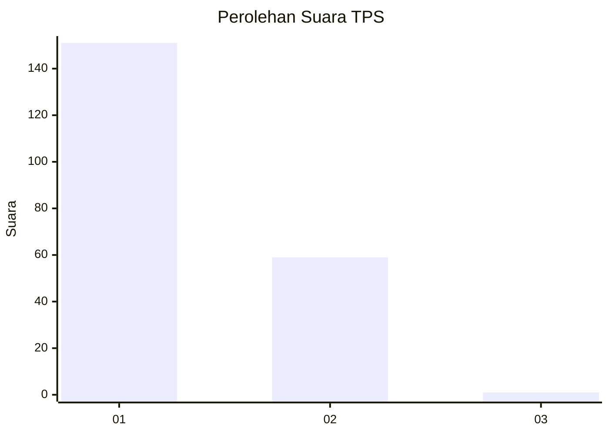
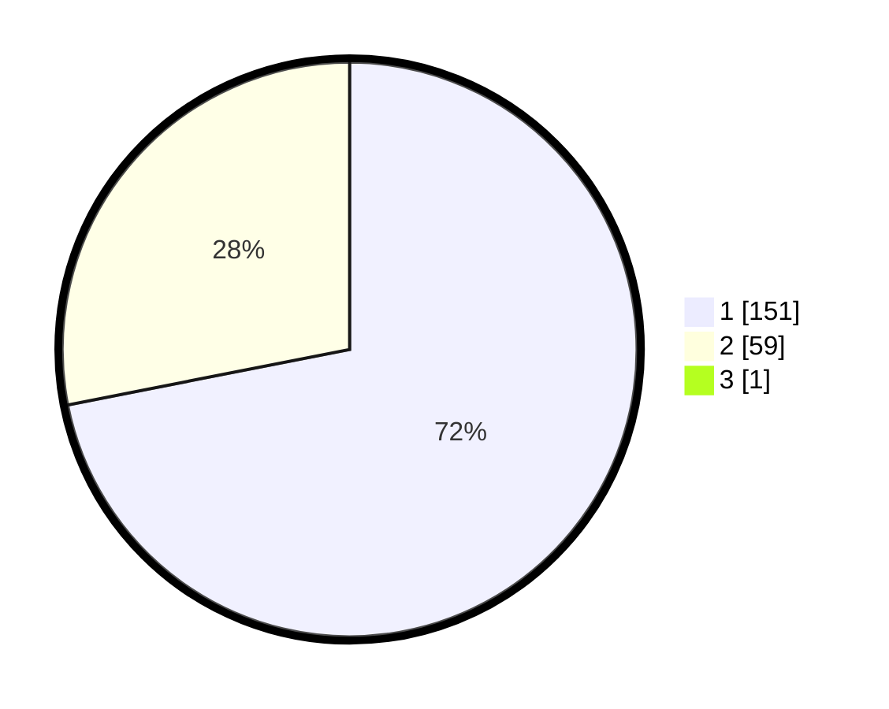

# Hasil

## Grafik

## Tabel

| No. | Nama Paslon    | Suara | Suara (raw) | Persentase |
|:--- |:-------------- | -----:| -----------:| ----------:|
| 1   | ANIES MUHAIMIN | 151   | [151][p-1]  | 71,56      |
| 2   | PRABOWO GIBRAN | 59    | [59][p-2]   | 27,96      |
| 3   | GANJAR MAHFUD  | 1     | [1][p-3]    | 0,47       |

[p-1]: https://github.com/gigit-pemilu/pemilu-2024-12-sumatera-utara/blob/main/pilpres/hitung-suara/sub/12-sumatera-utara/sub/77-kota-padang-sidempuan/sub/01-padangsidimpuan-utara/sub/1013-timbangan/sub/004-tps/sub/paslon-1.txt
[p-2]: https://github.com/gigit-pemilu/pemilu-2024-12-sumatera-utara/blob/main/pilpres/hitung-suara/sub/12-sumatera-utara/sub/77-kota-padang-sidempuan/sub/01-padangsidimpuan-utara/sub/1013-timbangan/sub/004-tps/sub/paslon-2.txt
[p-3]: https://github.com/gigit-pemilu/pemilu-2024-12-sumatera-utara/blob/main/pilpres/hitung-suara/sub/12-sumatera-utara/sub/77-kota-padang-sidempuan/sub/01-padangsidimpuan-utara/sub/1013-timbangan/sub/004-tps/sub/paslon-3.txt

## Foto C Plano

https://sirekap-obj-formc.kpu.go.id/1653/pemilu/ppwp/12/77/01/10/13/1277011013004-20240215-055302--a9802114-cbb9-4def-909b-5a4c711ffe5f.jpg

https://sirekap-obj-formc.kpu.go.id/1653/pemilu/ppwp/12/77/01/10/13/1277011013004-20240215-055535--e2a596cd-145a-4d42-8bbf-f1b8318e98b0.jpg

https://sirekap-obj-formc.kpu.go.id/1653/pemilu/ppwp/12/77/01/10/13/1277011013004-20240215-060656--b95e4c0d-65db-4ff4-9ccd-e041cac29460.jpg

## Metadata

| Key        | Value               |
| ---------- | ------------------- |
| Time Stamp | 2024-02-19 11:00:00 |

