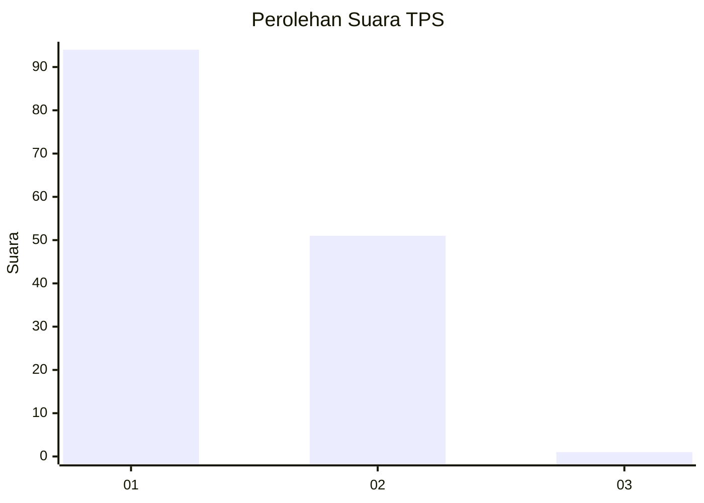
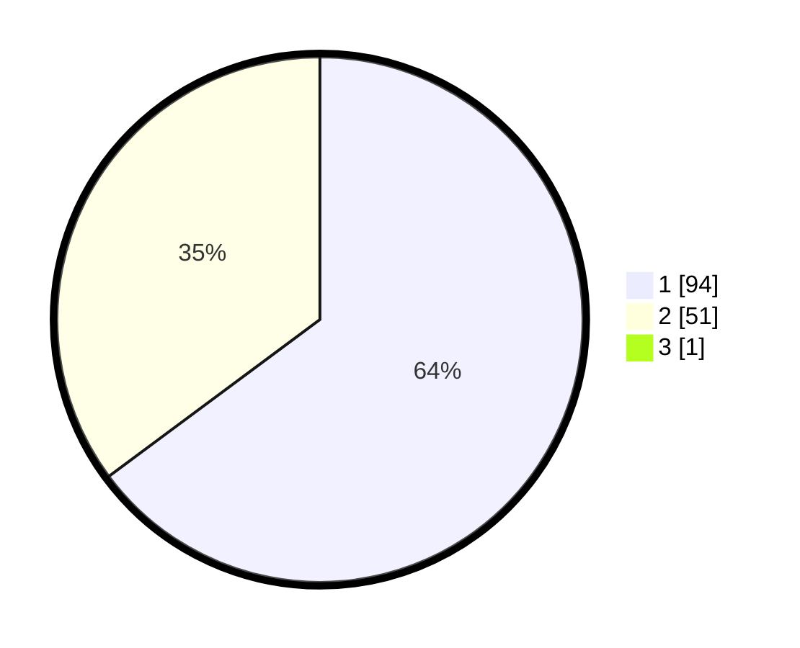

# Hasil

## Grafik

## Tabel

| No. | Nama Paslon    | Suara | Suara (raw) | Persentase |
|:--- |:-------------- | -----:| -----------:| ----------:|
| 1   | ANIES MUHAIMIN | 94    | [94][p-1]   | 64,38      |
| 2   | PRABOWO GIBRAN | 51    | [51][p-2]   | 34,93      |
| 3   | GANJAR MAHFUD  | 1     | [1][p-3]    | 0,68       |

[p-1]: https://github.com/gigit-pemilu/pemilu-2024/blob/main/pilpres/hitung-suara/sub/12-sumatera-utara/sub/77-kota-padang-sidempuan/sub/01-padangsidimpuan-utara/sub/1014-bincar/sub/001-tps/sub/paslon-1.txt
[p-2]: https://github.com/gigit-pemilu/pemilu-2024/blob/main/pilpres/hitung-suara/sub/12-sumatera-utara/sub/77-kota-padang-sidempuan/sub/01-padangsidimpuan-utara/sub/1014-bincar/sub/001-tps/sub/paslon-2.txt
[p-3]: https://github.com/gigit-pemilu/pemilu-2024/blob/main/pilpres/hitung-suara/sub/12-sumatera-utara/sub/77-kota-padang-sidempuan/sub/01-padangsidimpuan-utara/sub/1014-bincar/sub/001-tps/sub/paslon-3.txt

## Foto C Plano

https://sirekap-obj-formc.kpu.go.id/5f34/pemilu/ppwp/12/77/01/10/14/1277011014001-20240215-013604--e048c8da-7232-420d-ae6e-51eee6fbec54.jpg

https://sirekap-obj-formc.kpu.go.id/5f34/pemilu/ppwp/12/77/01/10/14/1277011014001-20240215-013728--a02787f1-76a0-4554-b3d8-35fdb343c2b0.jpg

https://sirekap-obj-formc.kpu.go.id/5f34/pemilu/ppwp/12/77/01/10/14/1277011014001-20240215-013820--10036eba-b8db-4e28-95c4-49406eb54aae.jpg

## Metadata

| Key        | Value               |
| ---------- | ------------------- |
| Time Stamp | 2024-02-19 11:00:00 |

