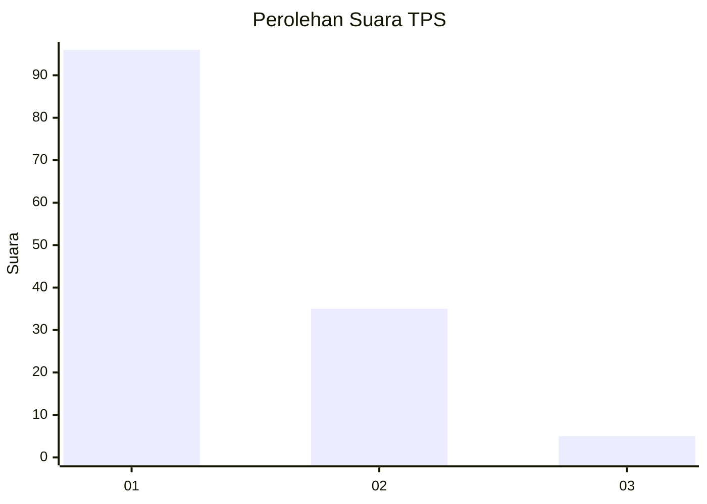
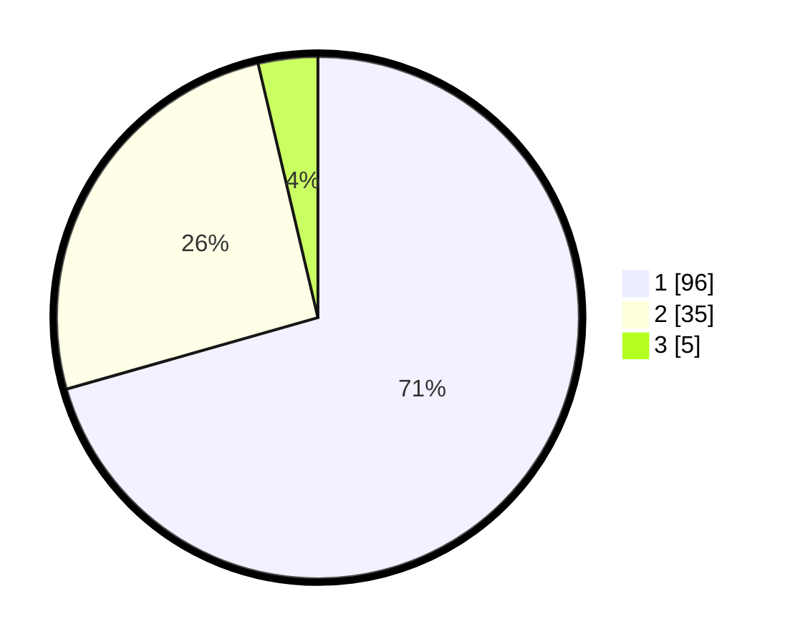

# Hasil

## Grafik

## Tabel

| No. | Nama Paslon    | Suara | Suara (raw) | Persentase |
|:--- |:-------------- | -----:| -----------:| ----------:|
| 1   | ANIES MUHAIMIN | 96    | [96][p-1]   | 70,59      |
| 2   | PRABOWO GIBRAN | 35    | [35][p-2]   | 25,74      |
| 3   | GANJAR MAHFUD  | 5     | [5][p-3]    | 3,68       |

[p-1]: https://github.com/gigit-pemilu/pemilu-2024/blob/main/pilpres/hitung-suara/sub/12-sumatera-utara/sub/77-kota-padang-sidempuan/sub/01-padangsidimpuan-utara/sub/1014-bincar/sub/007-tps/sub/paslon-1.txt
[p-2]: https://github.com/gigit-pemilu/pemilu-2024/blob/main/pilpres/hitung-suara/sub/12-sumatera-utara/sub/77-kota-padang-sidempuan/sub/01-padangsidimpuan-utara/sub/1014-bincar/sub/007-tps/sub/paslon-2.txt
[p-3]: https://github.com/gigit-pemilu/pemilu-2024/blob/main/pilpres/hitung-suara/sub/12-sumatera-utara/sub/77-kota-padang-sidempuan/sub/01-padangsidimpuan-utara/sub/1014-bincar/sub/007-tps/sub/paslon-3.txt

## Foto C Plano

https://sirekap-obj-formc.kpu.go.id/185a/pemilu/ppwp/12/77/01/10/14/1277011014007-20240215-030115--6ef6bf75-fc28-4056-a0ad-96a1b54eaade.jpg

https://sirekap-obj-formc.kpu.go.id/185a/pemilu/ppwp/12/77/01/10/14/1277011014007-20240215-030229--966dde3c-29d0-45bc-93fb-4632e366a0ae.jpg

https://sirekap-obj-formc.kpu.go.id/185a/pemilu/ppwp/12/77/01/10/14/1277011014007-20240215-025603--71d64a6f-ff4b-4300-a03e-2756782eda63.jpg

## Metadata

| Key        | Value               |
| ---------- | ------------------- |
| Time Stamp | 2024-02-19 11:00:00 |

