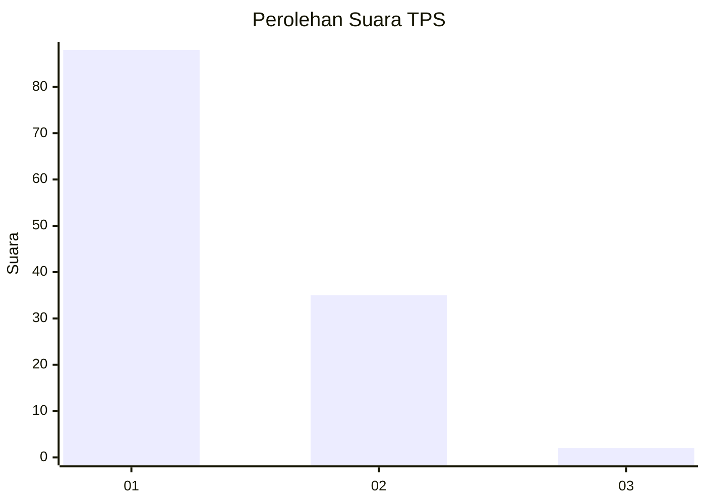
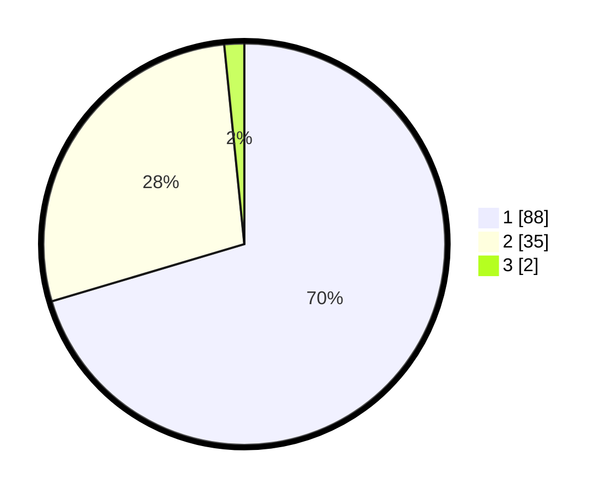

# Hasil

## Grafik

## Tabel

| No. | Nama Paslon    | Suara | Suara (raw) | Persentase |
|:--- |:-------------- | -----:| -----------:| ----------:|
| 1   | ANIES MUHAIMIN | 88    | [88][p-1]   | 70,40      |
| 2   | PRABOWO GIBRAN | 35    | [35][p-2]   | 28,00      |
| 3   | GANJAR MAHFUD  | 2     | [2][p-3]    | 1,60       |

[p-1]: https://github.com/gigit-pemilu/pemilu-2024/blob/main/pilpres/hitung-suara/sub/12-sumatera-utara/sub/77-kota-padang-sidempuan/sub/01-padangsidimpuan-utara/sub/1014-bincar/sub/009-tps/sub/paslon-1.txt
[p-2]: https://github.com/gigit-pemilu/pemilu-2024/blob/main/pilpres/hitung-suara/sub/12-sumatera-utara/sub/77-kota-padang-sidempuan/sub/01-padangsidimpuan-utara/sub/1014-bincar/sub/009-tps/sub/paslon-2.txt
[p-3]: https://github.com/gigit-pemilu/pemilu-2024/blob/main/pilpres/hitung-suara/sub/12-sumatera-utara/sub/77-kota-padang-sidempuan/sub/01-padangsidimpuan-utara/sub/1014-bincar/sub/009-tps/sub/paslon-3.txt

## Foto C Plano

https://sirekap-obj-formc.kpu.go.id/c7cd/pemilu/ppwp/12/77/01/10/14/1277011014009-20240215-013826--aa2ca4d1-6d3f-45f8-9cf1-3308cd05ecfb.jpg

https://sirekap-obj-formc.kpu.go.id/c7cd/pemilu/ppwp/12/77/01/10/14/1277011014009-20240215-013908--9ae4267d-cf87-4314-812f-06aa99aaec7b.jpg

https://sirekap-obj-formc.kpu.go.id/c7cd/pemilu/ppwp/12/77/01/10/14/1277011014009-20240215-013938--7b70cdad-f5aa-4ec6-8f12-f190b1cc3a5d.jpg

## Metadata

| Key        | Value               |
| ---------- | ------------------- |
| Time Stamp | 2024-02-19 11:00:00 |

