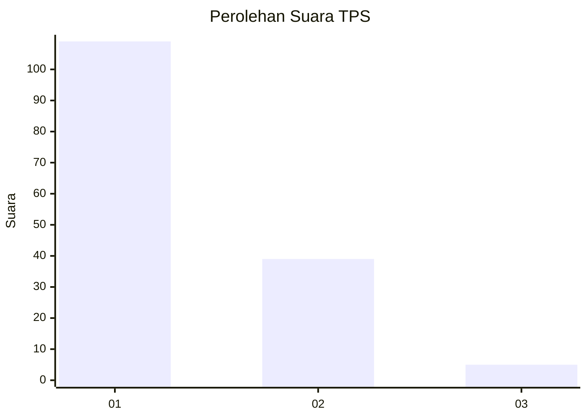
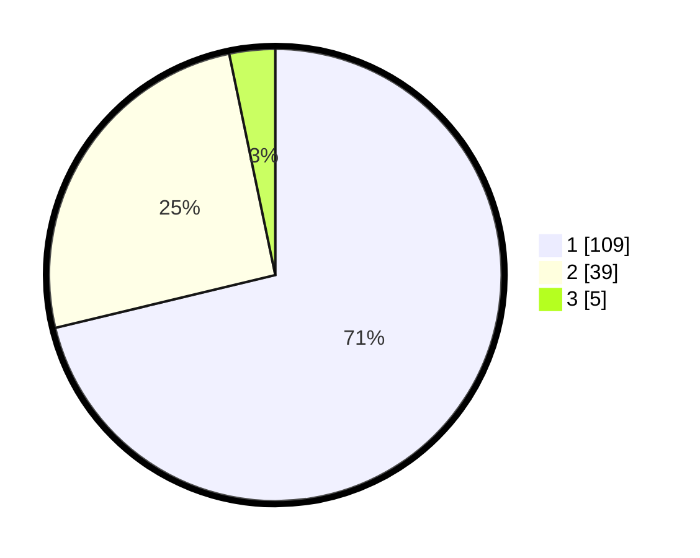

# Hasil

## Grafik

## Tabel

| No. | Nama Paslon    | Suara | Suara (raw) | Persentase |
|:--- |:-------------- | -----:| -----------:| ----------:|
| 1   | ANIES MUHAIMIN | 109   | [109][p-1]  | 71,24      |
| 2   | PRABOWO GIBRAN | 39    | [39][p-2]   | 25,49      |
| 3   | GANJAR MAHFUD  | 5     | [5][p-3]    | 3,27       |

[p-1]: https://github.com/gigit-pemilu/pemilu-2024/blob/main/pilpres/hitung-suara/sub/12-sumatera-utara/sub/77-kota-padang-sidempuan/sub/01-padangsidimpuan-utara/sub/1014-bincar/sub/011-tps/sub/paslon-1.txt
[p-2]: https://github.com/gigit-pemilu/pemilu-2024/blob/main/pilpres/hitung-suara/sub/12-sumatera-utara/sub/77-kota-padang-sidempuan/sub/01-padangsidimpuan-utara/sub/1014-bincar/sub/011-tps/sub/paslon-2.txt
[p-3]: https://github.com/gigit-pemilu/pemilu-2024/blob/main/pilpres/hitung-suara/sub/12-sumatera-utara/sub/77-kota-padang-sidempuan/sub/01-padangsidimpuan-utara/sub/1014-bincar/sub/011-tps/sub/paslon-3.txt

## Foto C Plano

https://sirekap-obj-formc.kpu.go.id/19c0/pemilu/ppwp/12/77/01/10/14/1277011014011-20240215-031412--0814a29b-7f19-41fe-b86b-a8441dc03dac.jpg

https://sirekap-obj-formc.kpu.go.id/19c0/pemilu/ppwp/12/77/01/10/14/1277011014011-20240215-024249--f4ed2ec3-aa68-4ef4-8b2a-69a0e6ae2f57.jpg

https://sirekap-obj-formc.kpu.go.id/19c0/pemilu/ppwp/12/77/01/10/14/1277011014011-20240215-023914--b01575d8-37c3-416d-b394-986caf4c2324.jpg

## Metadata

| Key        | Value               |
| ---------- | ------------------- |
| Time Stamp | 2024-02-19 11:00:00 |

