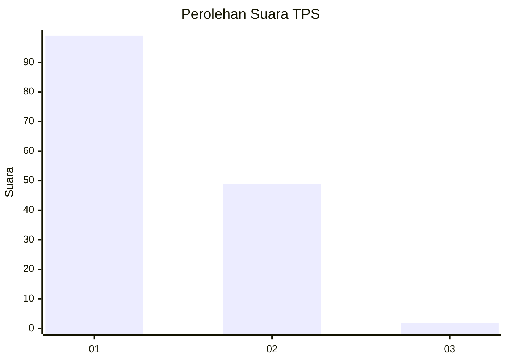
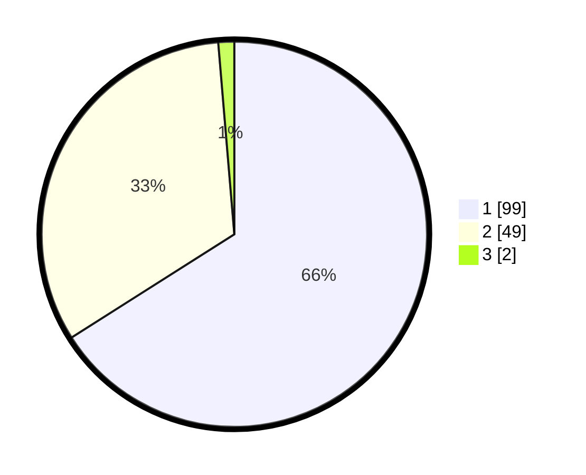

# Hasil

## Grafik

## Tabel

| No. | Nama Paslon    | Suara | Suara (raw) | Persentase |
|:--- |:-------------- | -----:| -----------:| ----------:|
| 1   | ANIES MUHAIMIN | 99    | [99][p-1]   | 66,00      |
| 2   | PRABOWO GIBRAN | 49    | [49][p-2]   | 32,67      |
| 3   | GANJAR MAHFUD  | 2     | [2][p-3]    | 1,33       |

[p-1]: https://github.com/gigit-pemilu/pemilu-2024-12-sumatera-utara/blob/main/pilpres/hitung-suara/sub/12-sumatera-utara/sub/77-kota-padang-sidempuan/sub/01-padangsidimpuan-utara/sub/1016-kayu-ombun/sub/004-tps/sub/paslon-1.txt
[p-2]: https://github.com/gigit-pemilu/pemilu-2024-12-sumatera-utara/blob/main/pilpres/hitung-suara/sub/12-sumatera-utara/sub/77-kota-padang-sidempuan/sub/01-padangsidimpuan-utara/sub/1016-kayu-ombun/sub/004-tps/sub/paslon-2.txt
[p-3]: https://github.com/gigit-pemilu/pemilu-2024-12-sumatera-utara/blob/main/pilpres/hitung-suara/sub/12-sumatera-utara/sub/77-kota-padang-sidempuan/sub/01-padangsidimpuan-utara/sub/1016-kayu-ombun/sub/004-tps/sub/paslon-3.txt

## Foto C Plano

https://sirekap-obj-formc.kpu.go.id/39ba/pemilu/ppwp/12/77/01/10/16/1277011016004-20240214-221858--97e0a9c6-6758-444b-a020-28272a759fbf.jpg

https://sirekap-obj-formc.kpu.go.id/39ba/pemilu/ppwp/12/77/01/10/16/1277011016004-20240214-222259--000ff8cb-0e8d-455e-b964-d9ce98783419.jpg

https://sirekap-obj-formc.kpu.go.id/39ba/pemilu/ppwp/12/77/01/10/16/1277011016004-20240214-222403--462bb9fd-ac4b-4153-b099-d347a250ce8d.jpg

## Metadata

| Key        | Value               |
| ---------- | ------------------- |
| Time Stamp | 2024-02-15 22:00:27 |

