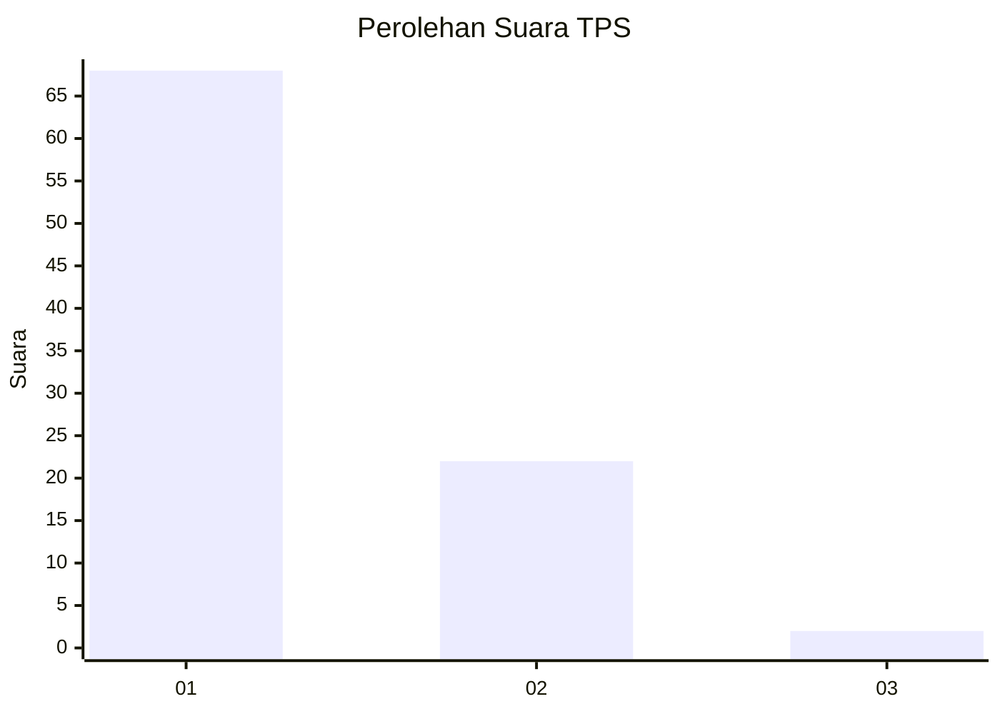
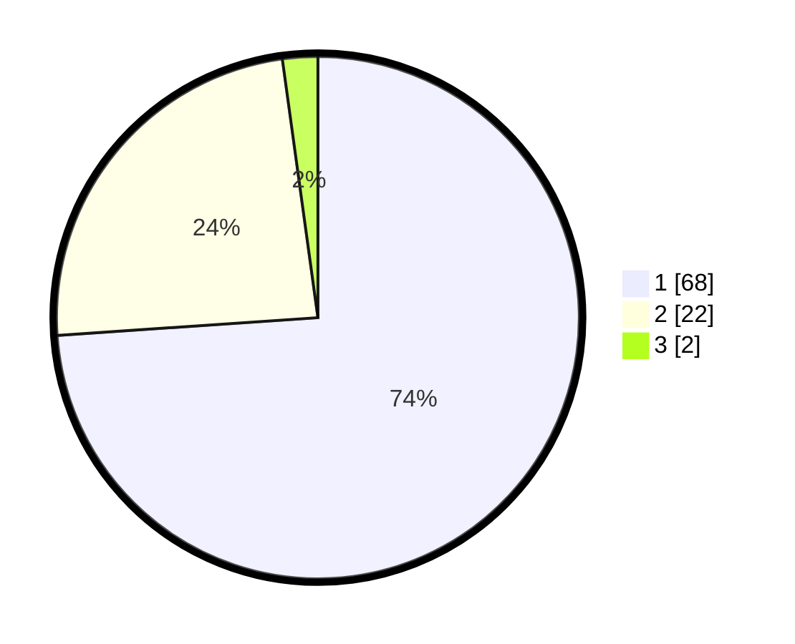

# Hasil

## Grafik

## Tabel

| No. | Nama Paslon    | Suara | Suara (raw) | Persentase |
|:--- |:-------------- | -----:| -----------:| ----------:|
| 1   | ANIES MUHAIMIN | 68    | [68][p-1]   | 73,91      |
| 2   | PRABOWO GIBRAN | 22    | [22][p-2]   | 23,91      |
| 3   | GANJAR MAHFUD  | 2     | [2][p-3]    | 2,17       |

[p-1]: https://github.com/gigit-pemilu/pemilu-2024/blob/main/pilpres/hitung-suara/sub/12-sumatera-utara/sub/77-kota-padang-sidempuan/sub/02-padangsidimpuan-selatan/sub/1002-wek-vi/sub/021-tps/sub/paslon-1.txt
[p-2]: https://github.com/gigit-pemilu/pemilu-2024/blob/main/pilpres/hitung-suara/sub/12-sumatera-utara/sub/77-kota-padang-sidempuan/sub/02-padangsidimpuan-selatan/sub/1002-wek-vi/sub/021-tps/sub/paslon-2.txt
[p-3]: https://github.com/gigit-pemilu/pemilu-2024/blob/main/pilpres/hitung-suara/sub/12-sumatera-utara/sub/77-kota-padang-sidempuan/sub/02-padangsidimpuan-selatan/sub/1002-wek-vi/sub/021-tps/sub/paslon-3.txt

## Foto C Plano

https://sirekap-obj-formc.kpu.go.id/e3cf/pemilu/ppwp/12/77/02/10/02/1277021002021-20240214-211954--381d8575-5efc-48d7-bde1-288926427b97.jpg

https://sirekap-obj-formc.kpu.go.id/e3cf/pemilu/ppwp/12/77/02/10/02/1277021002021-20240214-213857--95a7a829-92ee-4401-a95e-6df60324212d.jpg

https://sirekap-obj-formc.kpu.go.id/e3cf/pemilu/ppwp/12/77/02/10/02/1277021002021-20240214-220926--24e9a3b4-b13a-4ef8-b95a-19f919e4794c.jpg

## Metadata

| Key        | Value               |
| ---------- | ------------------- |
| Time Stamp | 2024-02-19 11:00:00 |

