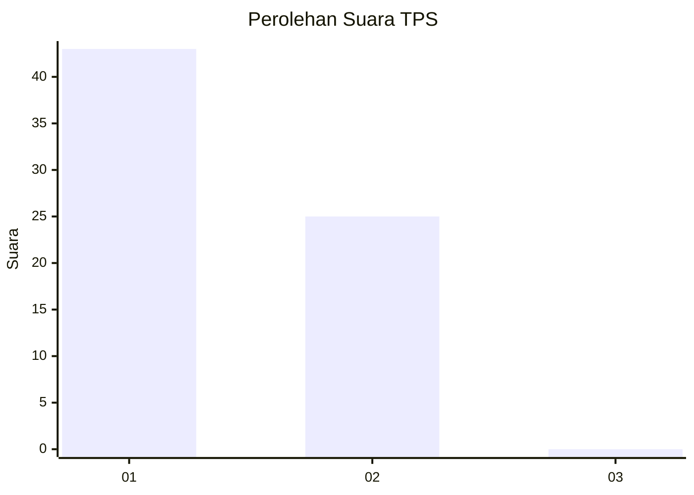
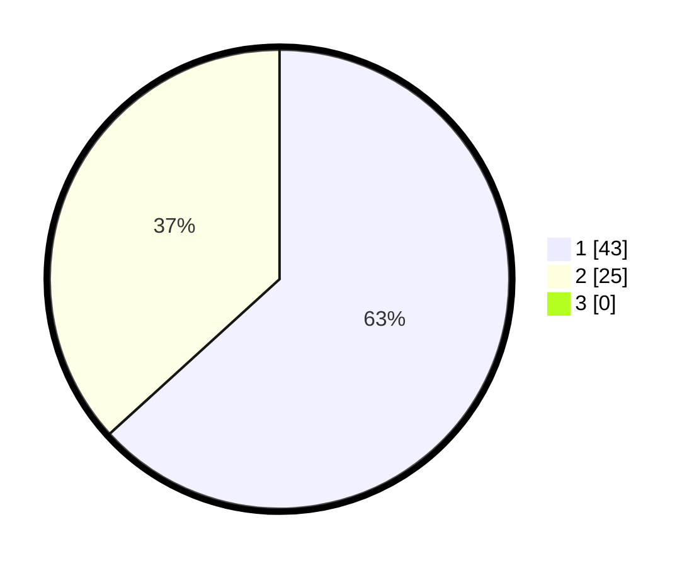

# Hasil

## Grafik

## Tabel

| No. | Nama Paslon    | Suara | Suara (raw) | Persentase |
|:--- |:-------------- | -----:| -----------:| ----------:|
| 1   | ANIES MUHAIMIN | 43    | [43][p-1]   | 63,24      |
| 2   | PRABOWO GIBRAN | 25    | [25][p-2]   | 36,76      |
| 3   | GANJAR MAHFUD  | 0     | [0][p-3]    | 0,00       |

[p-1]: https://github.com/gigit-pemilu/pemilu-2024/blob/main/pilpres/hitung-suara/sub/12-sumatera-utara/sub/77-kota-padang-sidempuan/sub/02-padangsidimpuan-selatan/sub/1004-sitamiang/sub/009-tps/sub/paslon-1.txt
[p-2]: https://github.com/gigit-pemilu/pemilu-2024/blob/main/pilpres/hitung-suara/sub/12-sumatera-utara/sub/77-kota-padang-sidempuan/sub/02-padangsidimpuan-selatan/sub/1004-sitamiang/sub/009-tps/sub/paslon-2.txt
[p-3]: https://github.com/gigit-pemilu/pemilu-2024/blob/main/pilpres/hitung-suara/sub/12-sumatera-utara/sub/77-kota-padang-sidempuan/sub/02-padangsidimpuan-selatan/sub/1004-sitamiang/sub/009-tps/sub/paslon-3.txt

## Foto C Plano

https://sirekap-obj-formc.kpu.go.id/eb61/pemilu/ppwp/12/77/02/10/04/1277021004009-20240215-032420--b0667d5d-355d-4beb-93c4-d93d0a10e03b.jpg

https://sirekap-obj-formc.kpu.go.id/eb61/pemilu/ppwp/12/77/02/10/04/1277021004009-20240215-032628--685aace0-6fc2-413e-acd9-34957634a3c5.jpg

https://sirekap-obj-formc.kpu.go.id/eb61/pemilu/ppwp/12/77/02/10/04/1277021004009-20240215-032817--241c29bf-9aaf-46fe-8dcf-c19f1d52f034.jpg

## Metadata

| Key        | Value               |
| ---------- | ------------------- |
| Time Stamp | 2024-02-19 11:00:00 |

