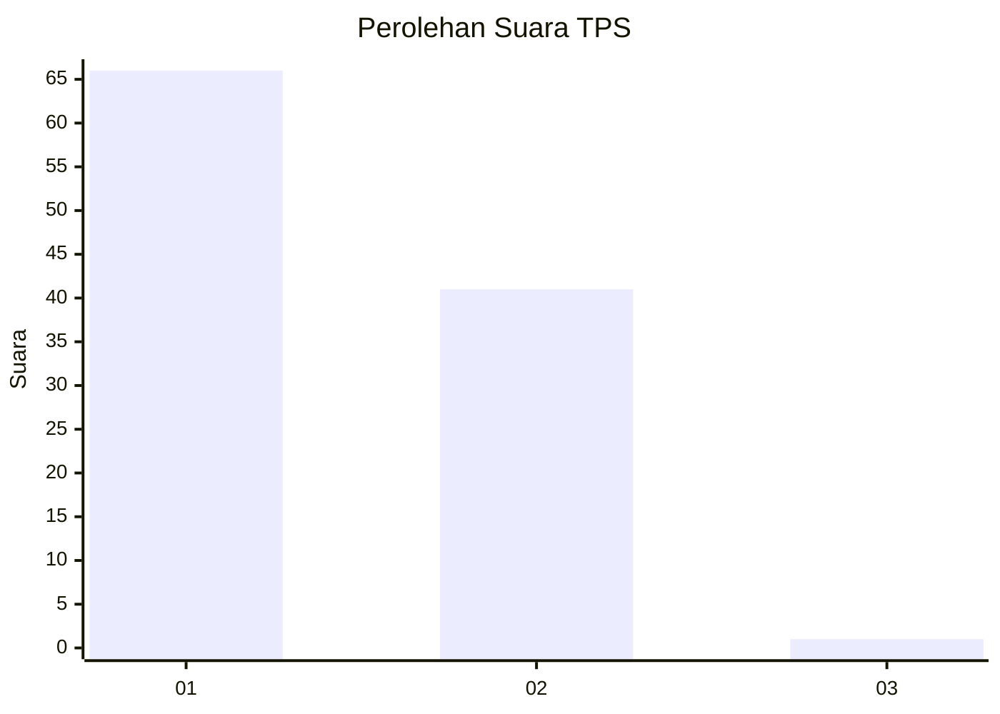
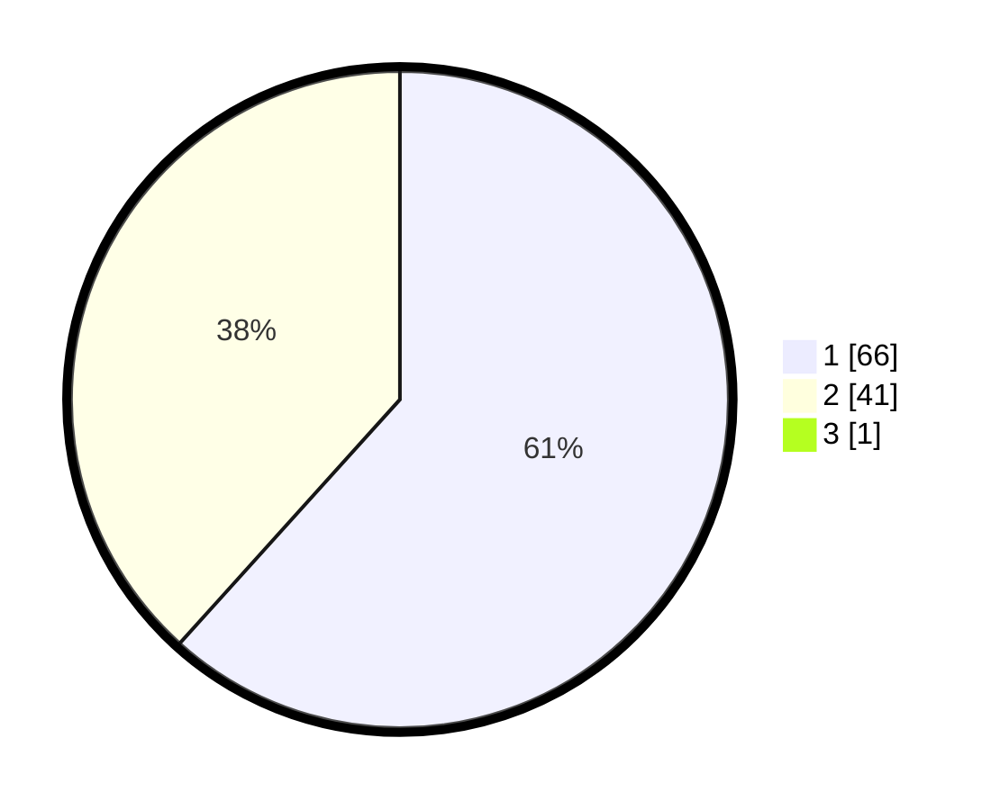

# Hasil

## Grafik

## Tabel

| No. | Nama Paslon    | Suara | Suara (raw) | Persentase |
|:--- |:-------------- | -----:| -----------:| ----------:|
| 1   | ANIES MUHAIMIN | 66    | [66][p-1]   | 61,11      |
| 2   | PRABOWO GIBRAN | 41    | [41][p-2]   | 37,96      |
| 3   | GANJAR MAHFUD  | 1     | [1][p-3]    | 0,93       |

[p-1]: https://github.com/gigit-pemilu/pemilu-2024/blob/main/pilpres/hitung-suara/sub/12-sumatera-utara/sub/77-kota-padang-sidempuan/sub/02-padangsidimpuan-selatan/sub/1005-ujung-padang/sub/022-tps/sub/paslon-1.txt
[p-2]: https://github.com/gigit-pemilu/pemilu-2024/blob/main/pilpres/hitung-suara/sub/12-sumatera-utara/sub/77-kota-padang-sidempuan/sub/02-padangsidimpuan-selatan/sub/1005-ujung-padang/sub/022-tps/sub/paslon-2.txt
[p-3]: https://github.com/gigit-pemilu/pemilu-2024/blob/main/pilpres/hitung-suara/sub/12-sumatera-utara/sub/77-kota-padang-sidempuan/sub/02-padangsidimpuan-selatan/sub/1005-ujung-padang/sub/022-tps/sub/paslon-3.txt

## Foto C Plano

https://sirekap-obj-formc.kpu.go.id/5280/pemilu/ppwp/12/77/02/10/05/1277021005022-20240214-212803--afefdc36-a37d-48e6-a35f-22f0e84851cb.jpg

https://sirekap-obj-formc.kpu.go.id/5280/pemilu/ppwp/12/77/02/10/05/1277021005022-20240214-213634--843bf91f-061f-4126-bcc7-896b0818abb7.jpg

https://sirekap-obj-formc.kpu.go.id/5280/pemilu/ppwp/12/77/02/10/05/1277021005022-20240214-213749--84ac24c8-fb42-4057-8d7f-ac8d69f71bc2.jpg

## Metadata

| Key        | Value               |
| ---------- | ------------------- |
| Time Stamp | 2024-02-16 03:00:26 |

