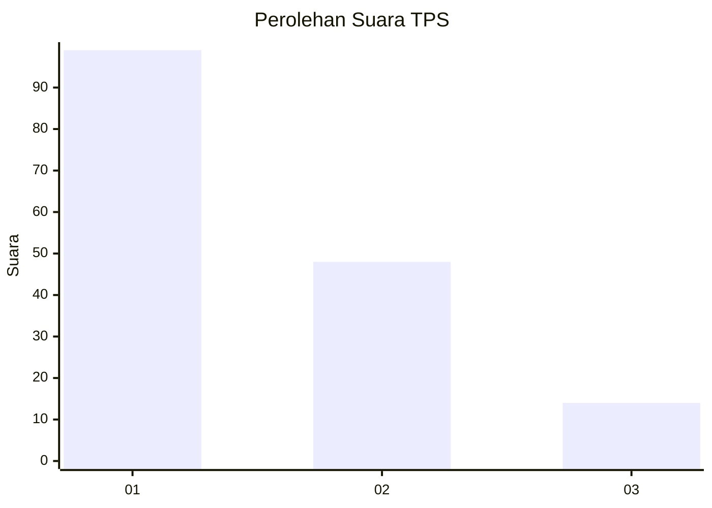
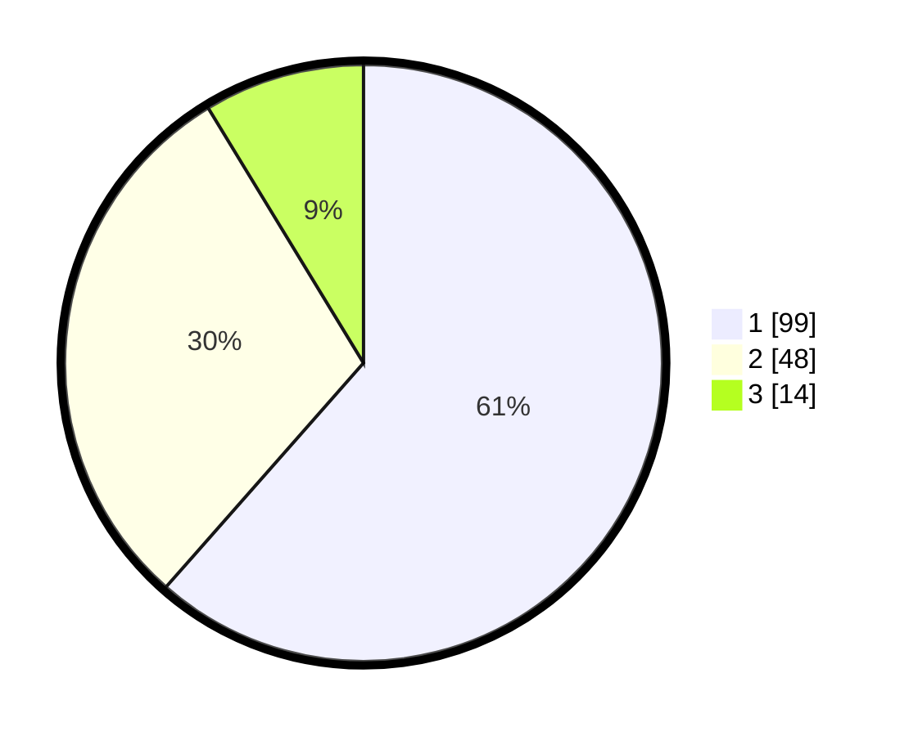

# Hasil

## Grafik

## Tabel

| No. | Nama Paslon    | Suara | Suara (raw) | Persentase |
|:--- |:-------------- | -----:| -----------:| ----------:|
| 1   | ANIES MUHAIMIN | 99    | [99][p-1]   | 61,49      |
| 2   | PRABOWO GIBRAN | 48    | [48][p-2]   | 29,81      |
| 3   | GANJAR MAHFUD  | 14    | [14][p-3]   | 8,70       |

[p-1]: https://github.com/gigit-pemilu/pemilu-2024-12-sumatera-utara/blob/main/pilpres/hitung-suara/sub/12-sumatera-utara/sub/77-kota-padang-sidempuan/sub/02-padangsidimpuan-selatan/sub/1010-hanopan/sub/002-tps/sub/paslon-1.txt
[p-2]: https://github.com/gigit-pemilu/pemilu-2024-12-sumatera-utara/blob/main/pilpres/hitung-suara/sub/12-sumatera-utara/sub/77-kota-padang-sidempuan/sub/02-padangsidimpuan-selatan/sub/1010-hanopan/sub/002-tps/sub/paslon-2.txt
[p-3]: https://github.com/gigit-pemilu/pemilu-2024-12-sumatera-utara/blob/main/pilpres/hitung-suara/sub/12-sumatera-utara/sub/77-kota-padang-sidempuan/sub/02-padangsidimpuan-selatan/sub/1010-hanopan/sub/002-tps/sub/paslon-3.txt

## Foto C Plano

https://sirekap-obj-formc.kpu.go.id/0952/pemilu/ppwp/12/77/02/10/10/1277021010002-20240215-033547--3466e9a6-b370-4a03-82c7-0be60461b515.jpg

https://sirekap-obj-formc.kpu.go.id/0952/pemilu/ppwp/12/77/02/10/10/1277021010002-20240215-034338--ff9c40e6-13d7-4cd4-813a-e6e579fce6d1.jpg

https://sirekap-obj-formc.kpu.go.id/0952/pemilu/ppwp/12/77/02/10/10/1277021010002-20240215-034203--79f8fd66-3e8a-40c6-b437-6cf641422565.jpg

## Metadata

| Key        | Value               |
| ---------- | ------------------- |
| Time Stamp | 2024-02-19 12:00:00 |

