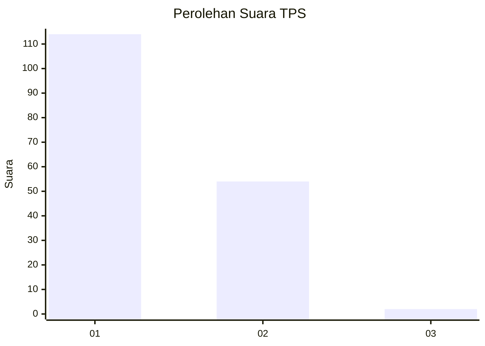
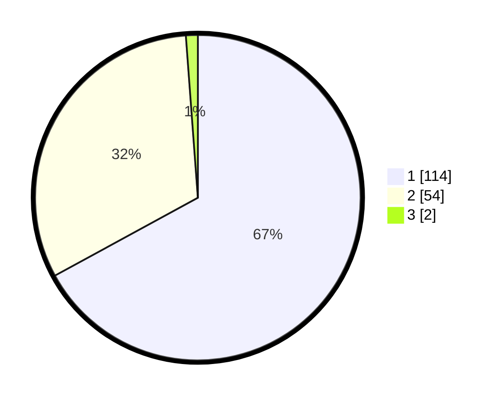

# Hasil

## Grafik

## Tabel

| No. | Nama Paslon    | Suara | Suara (raw) | Persentase |
|:--- |:-------------- | -----:| -----------:| ----------:|
| 1   | ANIES MUHAIMIN | 114   | [114][p-1]  | 67,06      |
| 2   | PRABOWO GIBRAN | 54    | [54][p-2]   | 31,76      |
| 3   | GANJAR MAHFUD  | 2     | [2][p-3]    | 1,18       |

[p-1]: https://github.com/gigit-pemilu/pemilu-2024/blob/main/pilpres/hitung-suara/sub/12-sumatera-utara/sub/77-kota-padang-sidempuan/sub/02-padangsidimpuan-selatan/sub/1011-padang-matinggi-lestari/sub/003-tps/sub/paslon-1.txt
[p-2]: https://github.com/gigit-pemilu/pemilu-2024/blob/main/pilpres/hitung-suara/sub/12-sumatera-utara/sub/77-kota-padang-sidempuan/sub/02-padangsidimpuan-selatan/sub/1011-padang-matinggi-lestari/sub/003-tps/sub/paslon-2.txt
[p-3]: https://github.com/gigit-pemilu/pemilu-2024/blob/main/pilpres/hitung-suara/sub/12-sumatera-utara/sub/77-kota-padang-sidempuan/sub/02-padangsidimpuan-selatan/sub/1011-padang-matinggi-lestari/sub/003-tps/sub/paslon-3.txt

## Foto C Plano

https://sirekap-obj-formc.kpu.go.id/0850/pemilu/ppwp/12/77/02/10/11/1277021011003-20240215-010556--6f0174c0-e5fa-4a7a-855a-2d02e9b6e170.jpg

https://sirekap-obj-formc.kpu.go.id/0850/pemilu/ppwp/12/77/02/10/11/1277021011003-20240215-011850--3ee97402-33a9-4bcb-8efc-16e6c5d7e634.jpg

https://sirekap-obj-formc.kpu.go.id/0850/pemilu/ppwp/12/77/02/10/11/1277021011003-20240215-012206--667cc697-7923-4177-b964-8f6b98f24591.jpg

## Metadata

| Key        | Value               |
| ---------- | ------------------- |
| Time Stamp | 2024-02-19 12:00:00 |

