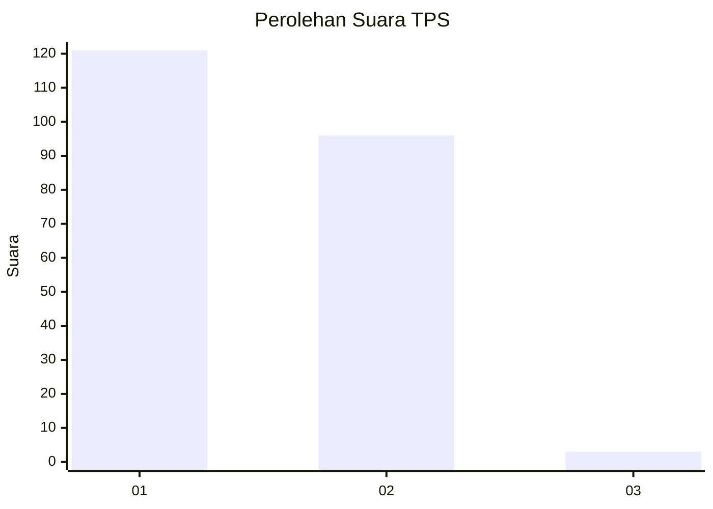
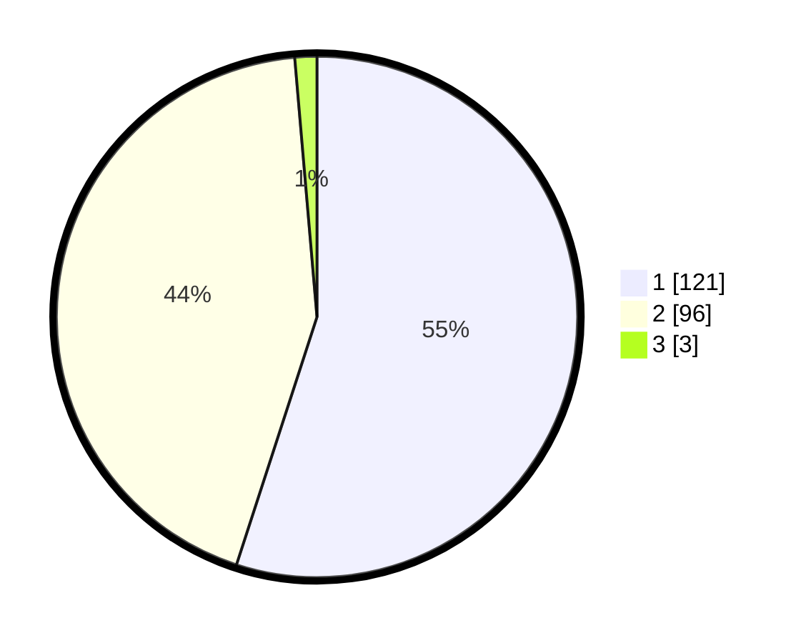

# Hasil

## Grafik

## Tabel

| No. | Nama Paslon    | Suara | Suara (raw) | Persentase |
|:--- |:-------------- | -----:| -----------:| ----------:|
| 1   | ANIES MUHAIMIN | 121   | [121][p-1]  | 55,00      |
| 2   | PRABOWO GIBRAN | 96    | [96][p-2]   | 43,64      |
| 3   | GANJAR MAHFUD  | 3     | [3][p-3]    | 1,36       |

[p-1]: https://github.com/gigit-pemilu/pemilu-2024-12-sumatera-utara/blob/main/pilpres/hitung-suara/sub/12-sumatera-utara/sub/77-kota-padang-sidempuan/sub/03-padangsidimpuan-batunadua/sub/1001-batunadua-jae/sub/002-tps/sub/paslon-1.txt
[p-2]: https://github.com/gigit-pemilu/pemilu-2024-12-sumatera-utara/blob/main/pilpres/hitung-suara/sub/12-sumatera-utara/sub/77-kota-padang-sidempuan/sub/03-padangsidimpuan-batunadua/sub/1001-batunadua-jae/sub/002-tps/sub/paslon-2.txt
[p-3]: https://github.com/gigit-pemilu/pemilu-2024-12-sumatera-utara/blob/main/pilpres/hitung-suara/sub/12-sumatera-utara/sub/77-kota-padang-sidempuan/sub/03-padangsidimpuan-batunadua/sub/1001-batunadua-jae/sub/002-tps/sub/paslon-3.txt

## Foto C Plano

https://sirekap-obj-formc.kpu.go.id/b2dc/pemilu/ppwp/12/77/03/10/01/1277031001002-20240214-192954--9b8d6903-9a61-47d7-af0b-70b0ea794aaa.jpg

https://sirekap-obj-formc.kpu.go.id/b2dc/pemilu/ppwp/12/77/03/10/01/1277031001002-20240214-192754--3ce0c834-8162-44fc-805c-7e9d0e332663.jpg

https://sirekap-obj-formc.kpu.go.id/b2dc/pemilu/ppwp/12/77/03/10/01/1277031001002-20240214-193203--eb8c1d56-3ec0-4942-92ef-f580a16032b5.jpg

## Metadata

| Key        | Value               |
| ---------- | ------------------- |
| Time Stamp | 2024-02-15 22:00:27 |

