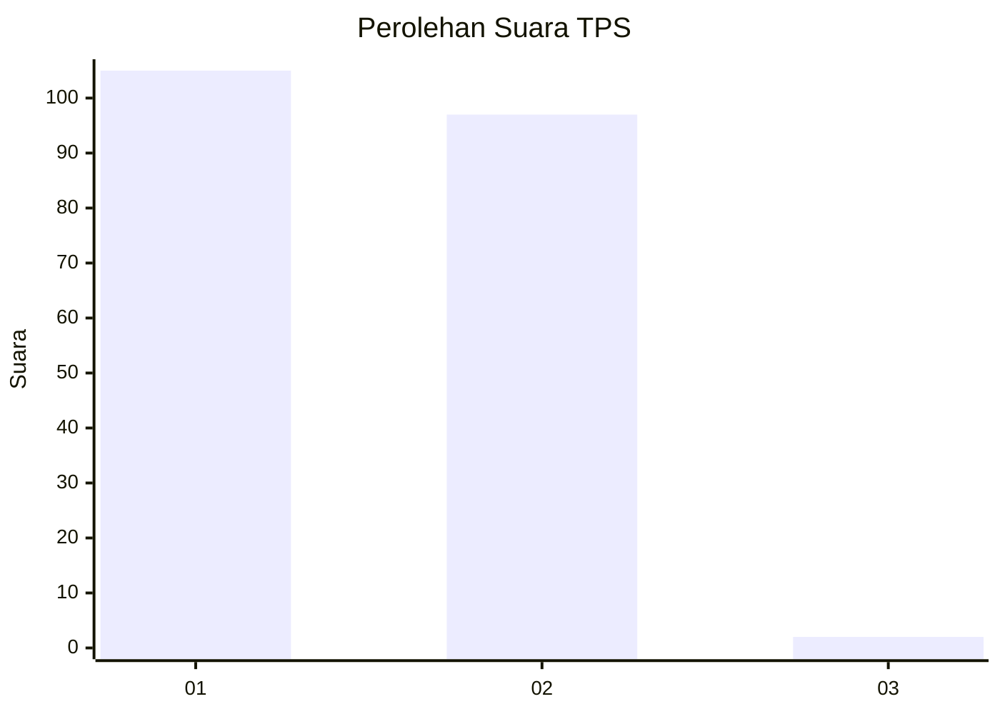
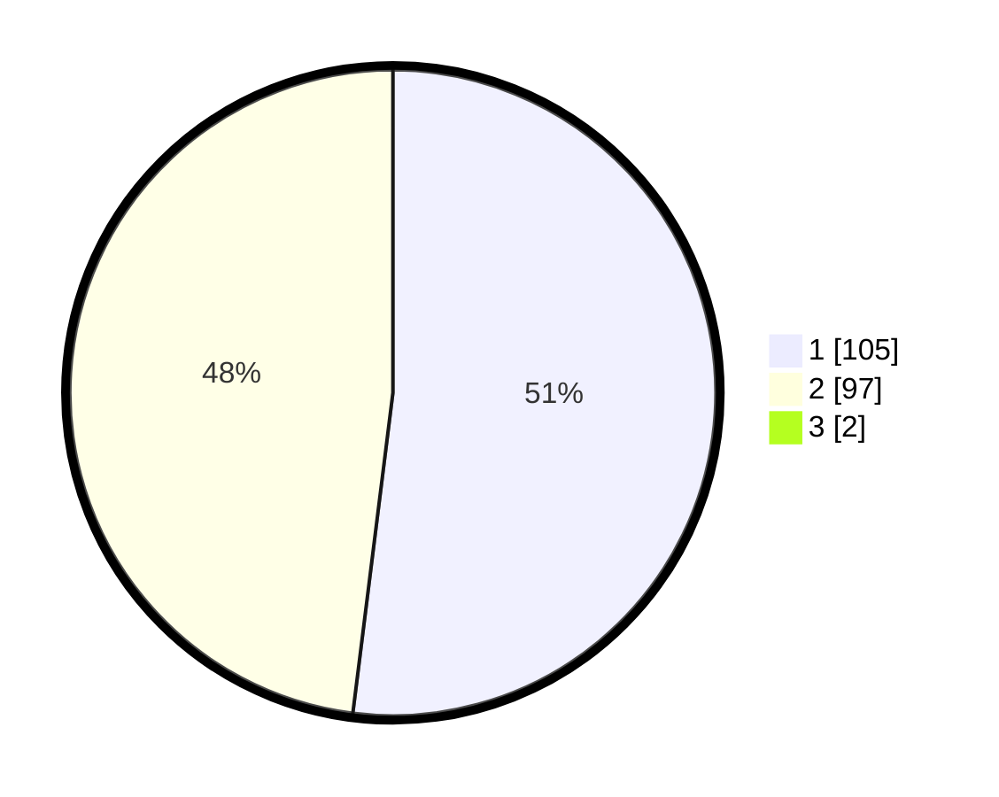

# Hasil

## Grafik

## Tabel

| No. | Nama Paslon    | Suara | Suara (raw) | Persentase |
|:--- |:-------------- | -----:| -----------:| ----------:|
| 1   | ANIES MUHAIMIN | 105   | [105][p-1]  | 51,47      |
| 2   | PRABOWO GIBRAN | 97    | [97][p-2]   | 47,55      |
| 3   | GANJAR MAHFUD  | 2     | [2][p-3]    | 0,98       |

[p-1]: https://github.com/gigit-pemilu/pemilu-2024-12-sumatera-utara/blob/main/pilpres/hitung-suara/sub/12-sumatera-utara/sub/77-kota-padang-sidempuan/sub/03-padangsidimpuan-batunadua/sub/1001-batunadua-jae/sub/004-tps/sub/paslon-1.txt
[p-2]: https://github.com/gigit-pemilu/pemilu-2024-12-sumatera-utara/blob/main/pilpres/hitung-suara/sub/12-sumatera-utara/sub/77-kota-padang-sidempuan/sub/03-padangsidimpuan-batunadua/sub/1001-batunadua-jae/sub/004-tps/sub/paslon-2.txt
[p-3]: https://github.com/gigit-pemilu/pemilu-2024-12-sumatera-utara/blob/main/pilpres/hitung-suara/sub/12-sumatera-utara/sub/77-kota-padang-sidempuan/sub/03-padangsidimpuan-batunadua/sub/1001-batunadua-jae/sub/004-tps/sub/paslon-3.txt

## Foto C Plano

https://sirekap-obj-formc.kpu.go.id/f113/pemilu/ppwp/12/77/03/10/01/1277031001004-20240215-091024--25bf29d4-d4dd-4848-b254-ae30073a54b4.jpg

https://sirekap-obj-formc.kpu.go.id/f113/pemilu/ppwp/12/77/03/10/01/1277031001004-20240214-233636--c8b7b80b-f77a-4b62-a550-8ce491fef73b.jpg

https://sirekap-obj-formc.kpu.go.id/f113/pemilu/ppwp/12/77/03/10/01/1277031001004-20240214-234029--a5605d3a-54c1-438c-a57f-16ee34624b1e.jpg

## Metadata

| Key        | Value               |
| ---------- | ------------------- |
| Time Stamp | 2024-02-19 12:00:00 |

