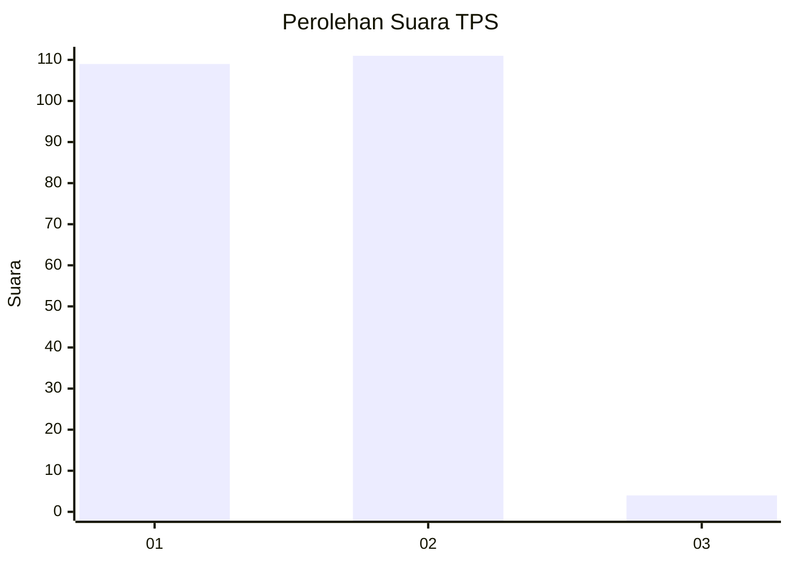
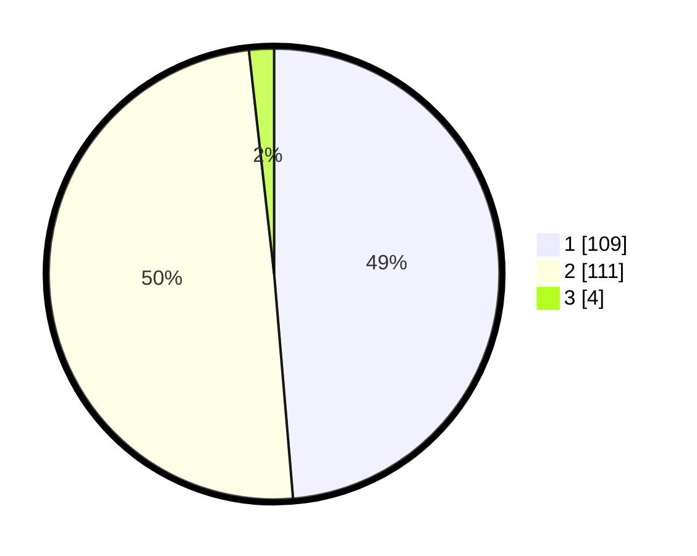

# Hasil

## Grafik

## Tabel

| No. | Nama Paslon    | Suara | Suara (raw) | Persentase |
|:--- |:-------------- | -----:| -----------:| ----------:|
| 1   | ANIES MUHAIMIN | 109   | [109][p-1]  | 48,66      |
| 2   | PRABOWO GIBRAN | 111   | [111][p-2]  | 49,55      |
| 3   | GANJAR MAHFUD  | 4     | [4][p-3]    | 1,79       |

[p-1]: https://github.com/gigit-pemilu/pemilu-2024-12-sumatera-utara/blob/main/pilpres/hitung-suara/sub/12-sumatera-utara/sub/77-kota-padang-sidempuan/sub/03-padangsidimpuan-batunadua/sub/1001-batunadua-jae/sub/006-tps/sub/paslon-1.txt
[p-2]: https://github.com/gigit-pemilu/pemilu-2024-12-sumatera-utara/blob/main/pilpres/hitung-suara/sub/12-sumatera-utara/sub/77-kota-padang-sidempuan/sub/03-padangsidimpuan-batunadua/sub/1001-batunadua-jae/sub/006-tps/sub/paslon-2.txt
[p-3]: https://github.com/gigit-pemilu/pemilu-2024-12-sumatera-utara/blob/main/pilpres/hitung-suara/sub/12-sumatera-utara/sub/77-kota-padang-sidempuan/sub/03-padangsidimpuan-batunadua/sub/1001-batunadua-jae/sub/006-tps/sub/paslon-3.txt

## Foto C Plano

https://sirekap-obj-formc.kpu.go.id/9c4c/pemilu/ppwp/12/77/03/10/01/1277031001006-20240215-051218--4760e9b2-7858-44d9-ba8f-44b02184d461.jpg

https://sirekap-obj-formc.kpu.go.id/9c4c/pemilu/ppwp/12/77/03/10/01/1277031001006-20240215-051334--1f85039d-b7fc-4d60-9446-9625c35a3d8e.jpg

https://sirekap-obj-formc.kpu.go.id/9c4c/pemilu/ppwp/12/77/03/10/01/1277031001006-20240215-051605--e4090464-8e51-42bc-a2a6-62da40006ee7.jpg

## Metadata

| Key        | Value               |
| ---------- | ------------------- |
| Time Stamp | 2024-02-24 22:31:28 |

