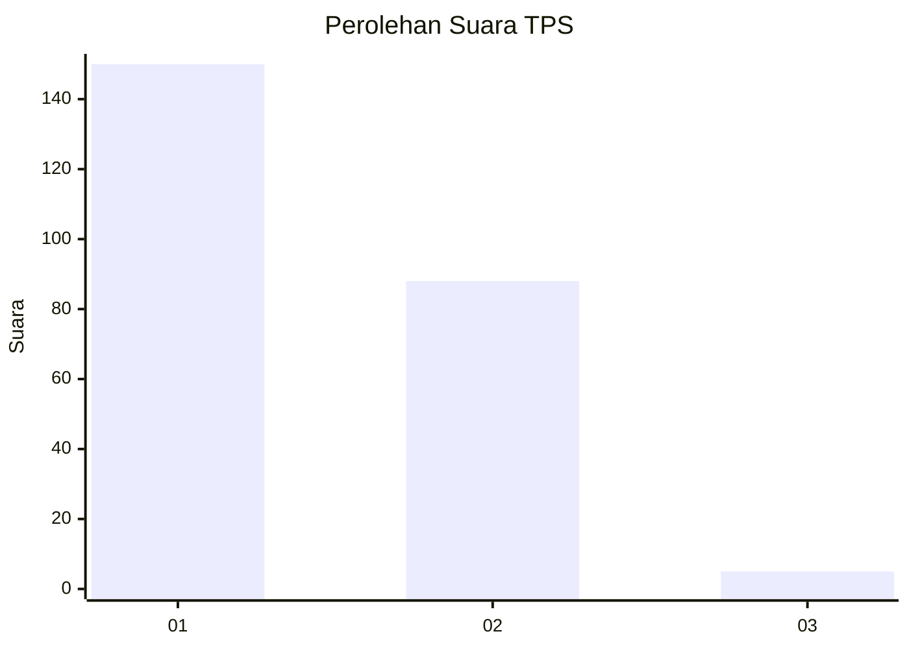
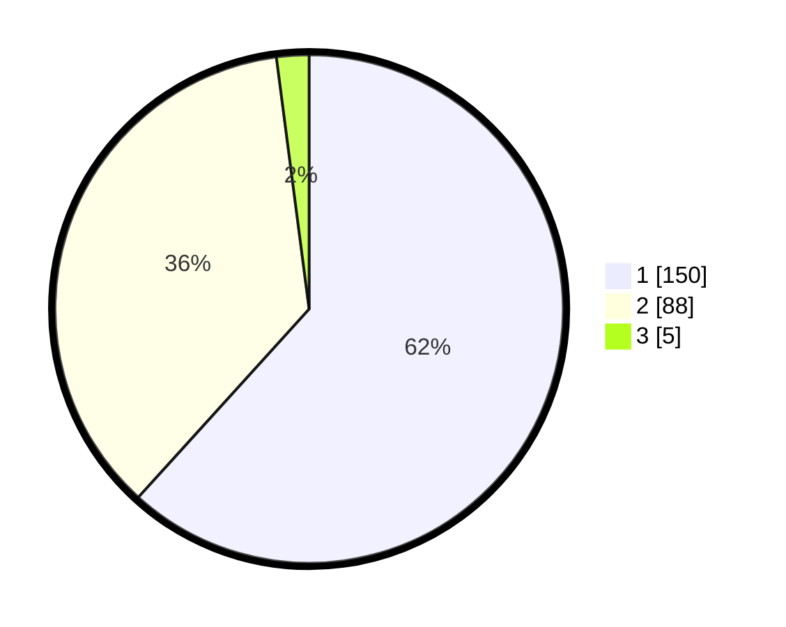

# Hasil

## Grafik

## Tabel

| No. | Nama Paslon    | Suara | Suara (raw) | Persentase |
|:--- |:-------------- | -----:| -----------:| ----------:|
| 1   | ANIES MUHAIMIN | 150   | [150][p-1]  | 61,73      |
| 2   | PRABOWO GIBRAN | 88    | [88][p-2]   | 36,21      |
| 3   | GANJAR MAHFUD  | 5     | [5][p-3]    | 2,06       |

[p-1]: https://github.com/gigit-pemilu/pemilu-2024/blob/main/pilpres/hitung-suara/sub/12-sumatera-utara/sub/77-kota-padang-sidempuan/sub/03-padangsidimpuan-batunadua/sub/1001-batunadua-jae/sub/013-tps/sub/paslon-1.txt
[p-2]: https://github.com/gigit-pemilu/pemilu-2024/blob/main/pilpres/hitung-suara/sub/12-sumatera-utara/sub/77-kota-padang-sidempuan/sub/03-padangsidimpuan-batunadua/sub/1001-batunadua-jae/sub/013-tps/sub/paslon-2.txt
[p-3]: https://github.com/gigit-pemilu/pemilu-2024/blob/main/pilpres/hitung-suara/sub/12-sumatera-utara/sub/77-kota-padang-sidempuan/sub/03-padangsidimpuan-batunadua/sub/1001-batunadua-jae/sub/013-tps/sub/paslon-3.txt

## Foto C Plano

https://sirekap-obj-formc.kpu.go.id/8f31/pemilu/ppwp/12/77/03/10/01/1277031001013-20240215-090658--892b2da6-56aa-4677-86e9-18225403f7e2.jpg

https://sirekap-obj-formc.kpu.go.id/8f31/pemilu/ppwp/12/77/03/10/01/1277031001013-20240215-091922--aa550aec-a9c3-4e3d-a537-b563648b8ae5.jpg

https://sirekap-obj-formc.kpu.go.id/8f31/pemilu/ppwp/12/77/03/10/01/1277031001013-20240215-092206--e963697d-1d59-47ad-8123-8ca632be355a.jpg

## Metadata

| Key        | Value               |
| ---------- | ------------------- |
| Time Stamp | 2024-02-19 12:00:00 |

