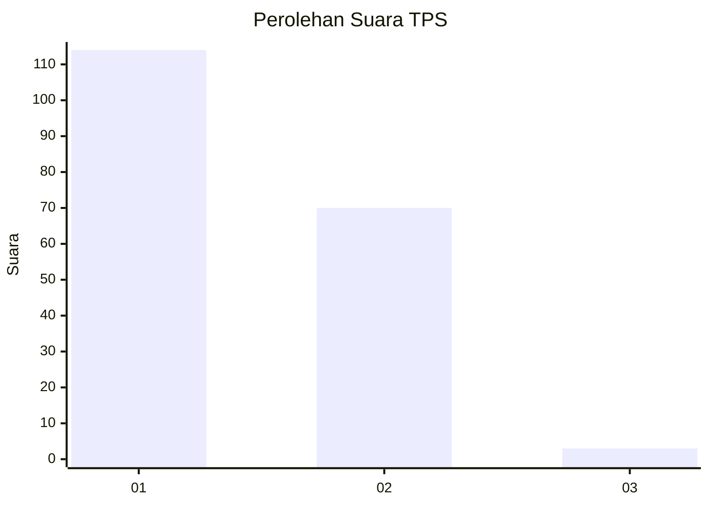
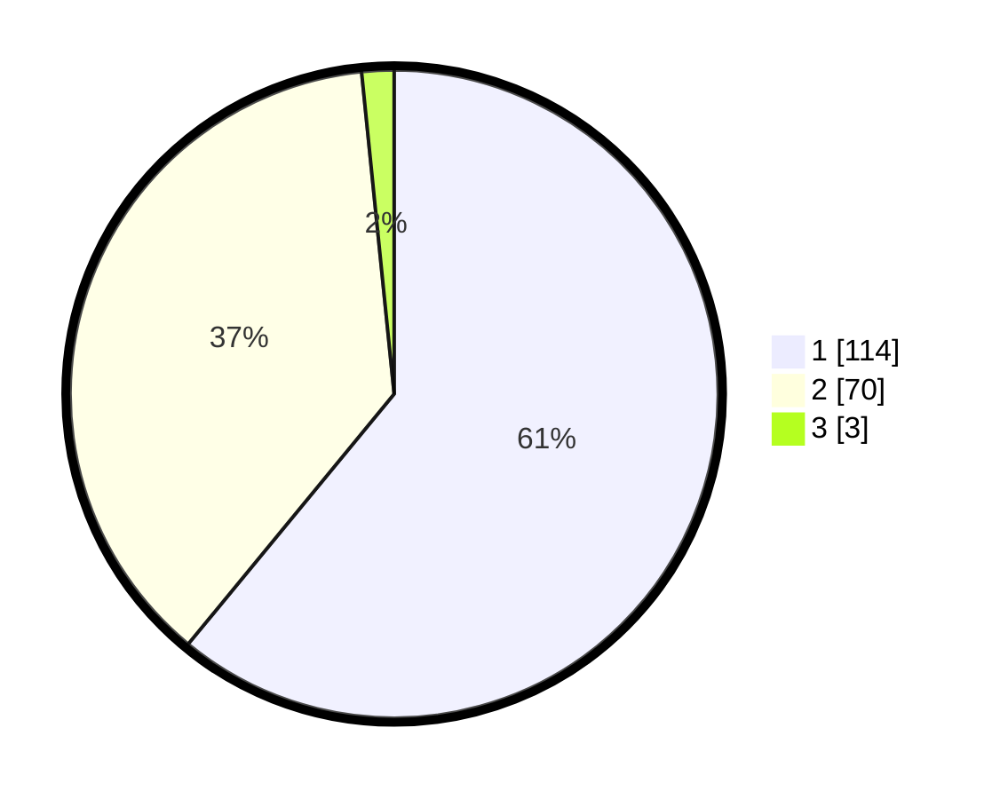

# Hasil

## Grafik

## Tabel

| No. | Nama Paslon    | Suara | Suara (raw) | Persentase |
|:--- |:-------------- | -----:| -----------:| ----------:|
| 1   | ANIES MUHAIMIN | 114   | [114][p-1]  | 60,96      |
| 2   | PRABOWO GIBRAN | 70    | [70][p-2]   | 37,43      |
| 3   | GANJAR MAHFUD  | 3     | [3][p-3]    | 1,60       |

[p-1]: https://github.com/gigit-pemilu/pemilu-2024/blob/main/pilpres/hitung-suara/sub/12-sumatera-utara/sub/77-kota-padang-sidempuan/sub/04-padangsidimpuan-hutaimbaru/sub/1001-hutaimbaru/sub/002-tps/sub/paslon-1.txt
[p-2]: https://github.com/gigit-pemilu/pemilu-2024/blob/main/pilpres/hitung-suara/sub/12-sumatera-utara/sub/77-kota-padang-sidempuan/sub/04-padangsidimpuan-hutaimbaru/sub/1001-hutaimbaru/sub/002-tps/sub/paslon-2.txt
[p-3]: https://github.com/gigit-pemilu/pemilu-2024/blob/main/pilpres/hitung-suara/sub/12-sumatera-utara/sub/77-kota-padang-sidempuan/sub/04-padangsidimpuan-hutaimbaru/sub/1001-hutaimbaru/sub/002-tps/sub/paslon-3.txt

## Foto C Plano

https://sirekap-obj-formc.kpu.go.id/629f/pemilu/ppwp/12/77/04/10/01/1277041001002-20240215-123729--9b66b456-0a9e-4213-bb9b-53f04f375bb6.jpg

https://sirekap-obj-formc.kpu.go.id/629f/pemilu/ppwp/12/77/04/10/01/1277041001002-20240215-100603--b08a61cd-4f13-434c-abfe-a4e1b9bb9522.jpg

https://sirekap-obj-formc.kpu.go.id/629f/pemilu/ppwp/12/77/04/10/01/1277041001002-20240215-123955--aa133193-f716-49aa-880f-b6bfd6643251.jpg

## Metadata

| Key        | Value               |
| ---------- | ------------------- |
| Time Stamp | 2024-02-19 12:00:00 |

