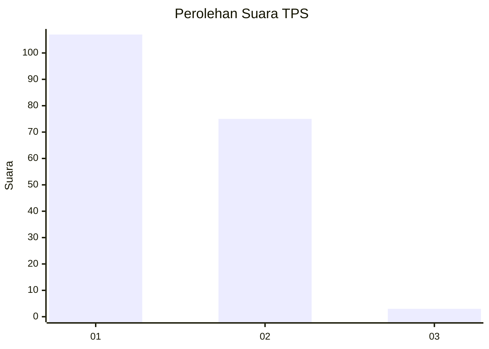
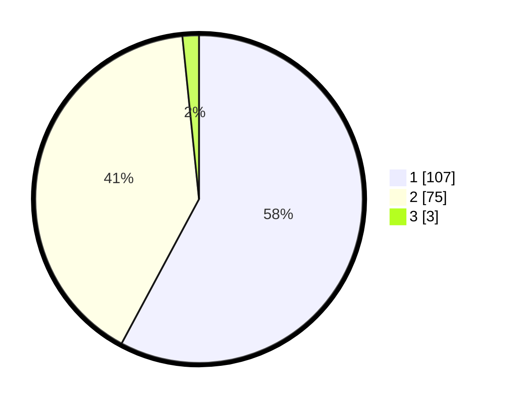

# Hasil

## Grafik

## Tabel

| No. | Nama Paslon    | Suara | Suara (raw) | Persentase |
|:--- |:-------------- | -----:| -----------:| ----------:|
| 1   | ANIES MUHAIMIN | 107   | [107][p-1]  | 57,84      |
| 2   | PRABOWO GIBRAN | 75    | [75][p-2]   | 40,54      |
| 3   | GANJAR MAHFUD  | 3     | [3][p-3]    | 1,62       |

[p-1]: https://github.com/gigit-pemilu/pemilu-2024/blob/main/pilpres/hitung-suara/sub/12-sumatera-utara/sub/77-kota-padang-sidempuan/sub/04-padangsidimpuan-hutaimbaru/sub/1001-hutaimbaru/sub/003-tps/sub/paslon-1.txt
[p-2]: https://github.com/gigit-pemilu/pemilu-2024/blob/main/pilpres/hitung-suara/sub/12-sumatera-utara/sub/77-kota-padang-sidempuan/sub/04-padangsidimpuan-hutaimbaru/sub/1001-hutaimbaru/sub/003-tps/sub/paslon-2.txt
[p-3]: https://github.com/gigit-pemilu/pemilu-2024/blob/main/pilpres/hitung-suara/sub/12-sumatera-utara/sub/77-kota-padang-sidempuan/sub/04-padangsidimpuan-hutaimbaru/sub/1001-hutaimbaru/sub/003-tps/sub/paslon-3.txt

## Foto C Plano

https://sirekap-obj-formc.kpu.go.id/d453/pemilu/ppwp/12/77/04/10/01/1277041001003-20240215-111957--2111b9c8-ac12-4dd5-93b4-c08ddf9480a3.jpg

https://sirekap-obj-formc.kpu.go.id/d453/pemilu/ppwp/12/77/04/10/01/1277041001003-20240215-112020--2a228008-d0f7-4643-b943-aee4d71f755f.jpg

https://sirekap-obj-formc.kpu.go.id/d453/pemilu/ppwp/12/77/04/10/01/1277041001003-20240215-112026--0ffc8629-be03-4795-8c1e-8986f39c8cad.jpg

## Metadata

| Key        | Value               |
| ---------- | ------------------- |
| Time Stamp | 2024-02-25 22:00:00 |

