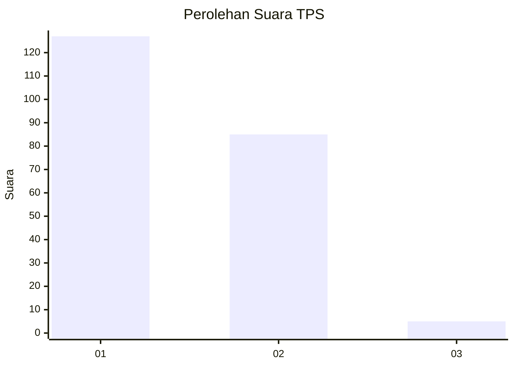
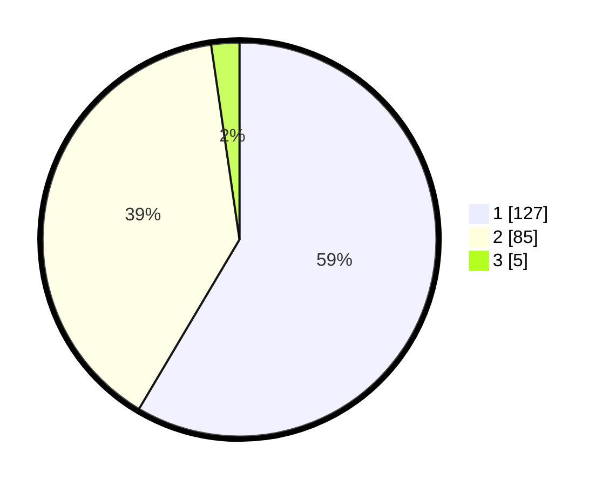

# Hasil

## Grafik

## Tabel

| No. | Nama Paslon    | Suara | Suara (raw) | Persentase |
|:--- |:-------------- | -----:| -----------:| ----------:|
| 1   | ANIES MUHAIMIN | 127   | [127][p-1]  | 58,53      |
| 2   | PRABOWO GIBRAN | 85    | [85][p-2]   | 39,17      |
| 3   | GANJAR MAHFUD  | 5     | [5][p-3]    | 2,30       |

[p-1]: https://github.com/gigit-pemilu/pemilu-2024-12-sumatera-utara/blob/main/pilpres/hitung-suara/sub/12-sumatera-utara/sub/77-kota-padang-sidempuan/sub/04-padangsidimpuan-hutaimbaru/sub/1001-hutaimbaru/sub/005-tps/sub/paslon-1.txt
[p-2]: https://github.com/gigit-pemilu/pemilu-2024-12-sumatera-utara/blob/main/pilpres/hitung-suara/sub/12-sumatera-utara/sub/77-kota-padang-sidempuan/sub/04-padangsidimpuan-hutaimbaru/sub/1001-hutaimbaru/sub/005-tps/sub/paslon-2.txt
[p-3]: https://github.com/gigit-pemilu/pemilu-2024-12-sumatera-utara/blob/main/pilpres/hitung-suara/sub/12-sumatera-utara/sub/77-kota-padang-sidempuan/sub/04-padangsidimpuan-hutaimbaru/sub/1001-hutaimbaru/sub/005-tps/sub/paslon-3.txt

## Foto C Plano

https://sirekap-obj-formc.kpu.go.id/21c0/pemilu/ppwp/12/77/04/10/01/1277041001005-20240216-195435--bf104e96-d357-4cc5-8435-8f7e0fd9bd69.jpg

https://sirekap-obj-formc.kpu.go.id/21c0/pemilu/ppwp/12/77/04/10/01/1277041001005-20240214-225002--8ecbd9f7-6c2a-4f48-9501-16edee5b9a4a.jpg

https://sirekap-obj-formc.kpu.go.id/21c0/pemilu/ppwp/12/77/04/10/01/1277041001005-20240214-225321--83129f5c-8b58-4de6-8273-ea533d30b527.jpg

## Metadata

| Key        | Value               |
| ---------- | ------------------- |
| Time Stamp | 2024-02-24 22:31:28 |

