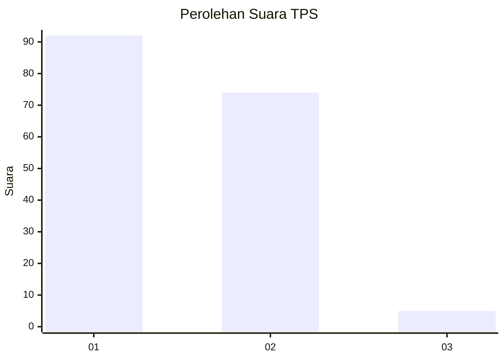
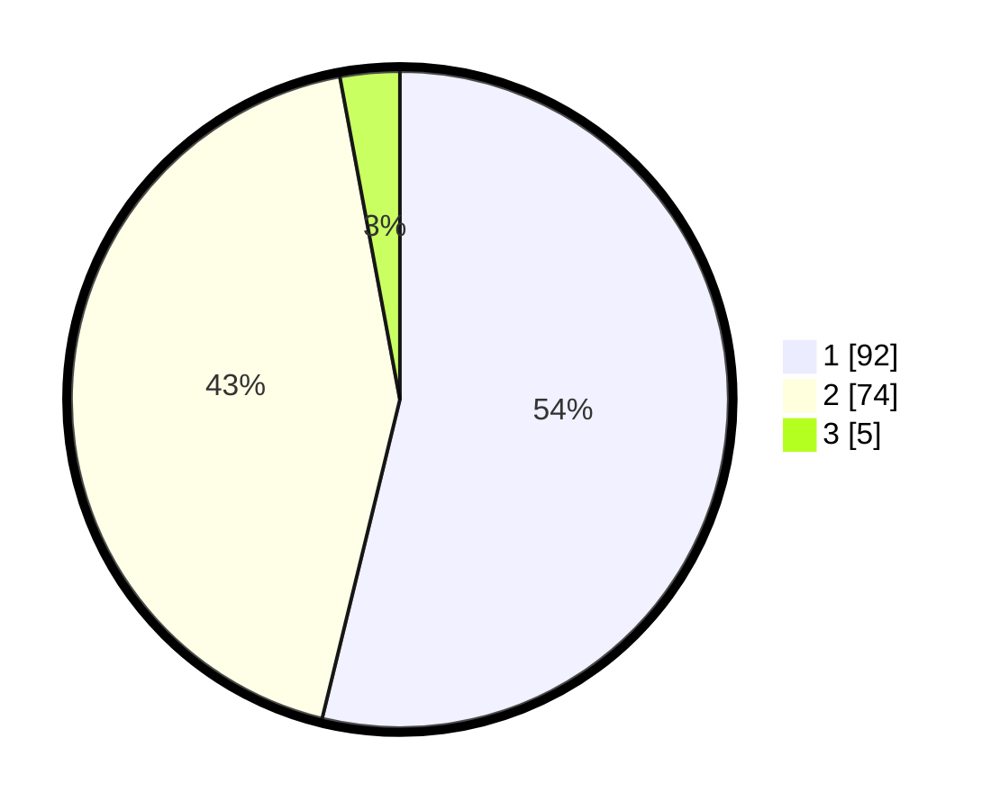

# Hasil

## Grafik

## Tabel

| No. | Nama Paslon    | Suara | Suara (raw) | Persentase |
|:--- |:-------------- | -----:| -----------:| ----------:|
| 1   | ANIES MUHAIMIN | 92    | [92][p-1]   | 53,80      |
| 2   | PRABOWO GIBRAN | 74    | [74][p-2]   | 43,27      |
| 3   | GANJAR MAHFUD  | 5     | [5][p-3]    | 2,92       |

[p-1]: https://github.com/gigit-pemilu/pemilu-2024/blob/main/pilpres/hitung-suara/sub/12-sumatera-utara/sub/77-kota-padang-sidempuan/sub/05-padangsidimpuan-tenggara/sub/1001-sihitang/sub/003-tps/sub/paslon-1.txt
[p-2]: https://github.com/gigit-pemilu/pemilu-2024/blob/main/pilpres/hitung-suara/sub/12-sumatera-utara/sub/77-kota-padang-sidempuan/sub/05-padangsidimpuan-tenggara/sub/1001-sihitang/sub/003-tps/sub/paslon-2.txt
[p-3]: https://github.com/gigit-pemilu/pemilu-2024/blob/main/pilpres/hitung-suara/sub/12-sumatera-utara/sub/77-kota-padang-sidempuan/sub/05-padangsidimpuan-tenggara/sub/1001-sihitang/sub/003-tps/sub/paslon-3.txt

## Foto C Plano

https://sirekap-obj-formc.kpu.go.id/6844/pemilu/ppwp/12/77/05/10/01/1277051001003-20240215-155937--53f209e4-b49c-44f0-b908-722aa9ac915c.jpg

https://sirekap-obj-formc.kpu.go.id/6844/pemilu/ppwp/12/77/05/10/01/1277051001003-20240215-162029--da9c1012-51c2-4453-94eb-39b6829b9822.jpg

https://sirekap-obj-formc.kpu.go.id/6844/pemilu/ppwp/12/77/05/10/01/1277051001003-20240215-162037--fd88181e-c78f-412b-8476-cdc6d14418e5.jpg

## Metadata

| Key        | Value               |
| ---------- | ------------------- |
| Time Stamp | 2024-02-15 22:30:27 |

