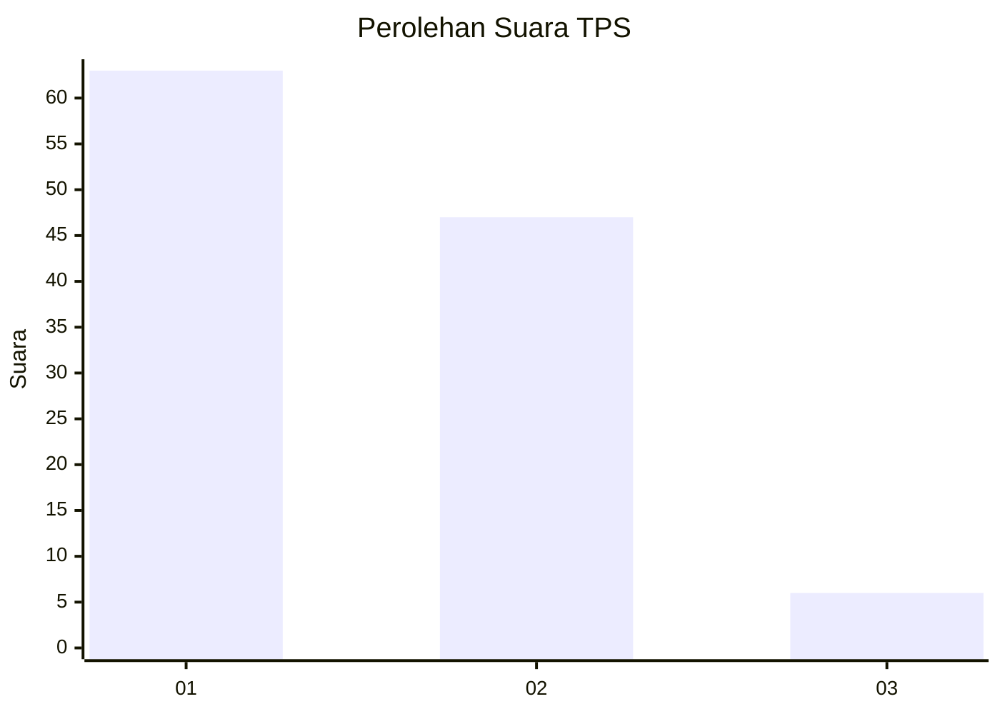
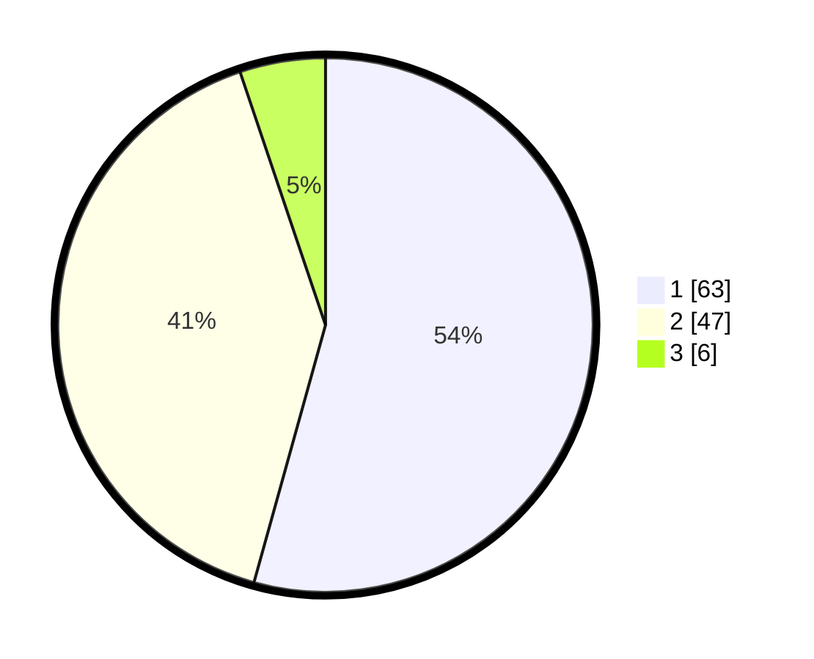

# Hasil

## Grafik

## Tabel

| No. | Nama Paslon    | Suara | Suara (raw) | Persentase |
|:--- |:-------------- | -----:| -----------:| ----------:|
| 1   | ANIES MUHAIMIN | 63    | [63][p-1]   | 54,31      |
| 2   | PRABOWO GIBRAN | 47    | [47][p-2]   | 40,52      |
| 3   | GANJAR MAHFUD  | 6     | [6][p-3]    | 5,17       |

[p-1]: https://github.com/gigit-pemilu/pemilu-2024-12-sumatera-utara/blob/main/pilpres/hitung-suara/sub/12-sumatera-utara/sub/77-kota-padang-sidempuan/sub/05-padangsidimpuan-tenggara/sub/1001-sihitang/sub/004-tps/sub/paslon-1.txt
[p-2]: https://github.com/gigit-pemilu/pemilu-2024-12-sumatera-utara/blob/main/pilpres/hitung-suara/sub/12-sumatera-utara/sub/77-kota-padang-sidempuan/sub/05-padangsidimpuan-tenggara/sub/1001-sihitang/sub/004-tps/sub/paslon-2.txt
[p-3]: https://github.com/gigit-pemilu/pemilu-2024-12-sumatera-utara/blob/main/pilpres/hitung-suara/sub/12-sumatera-utara/sub/77-kota-padang-sidempuan/sub/05-padangsidimpuan-tenggara/sub/1001-sihitang/sub/004-tps/sub/paslon-3.txt

## Foto C Plano

https://sirekap-obj-formc.kpu.go.id/fcbc/pemilu/ppwp/12/77/05/10/01/1277051001004-20240216-155224--6ae7ec93-4a91-4da4-b1d2-49824f2b4a8a.jpg

https://sirekap-obj-formc.kpu.go.id/fcbc/pemilu/ppwp/12/77/05/10/01/1277051001004-20240216-155306--16d44906-5cdb-4d73-a80f-017844fb7126.jpg

https://sirekap-obj-formc.kpu.go.id/fcbc/pemilu/ppwp/12/77/05/10/01/1277051001004-20240216-155308--a2411b02-ba76-429e-9ecb-cd5d74c50868.jpg

## Metadata

| Key        | Value               |
| ---------- | ------------------- |
| Time Stamp | 2024-02-25 17:00:00 |

