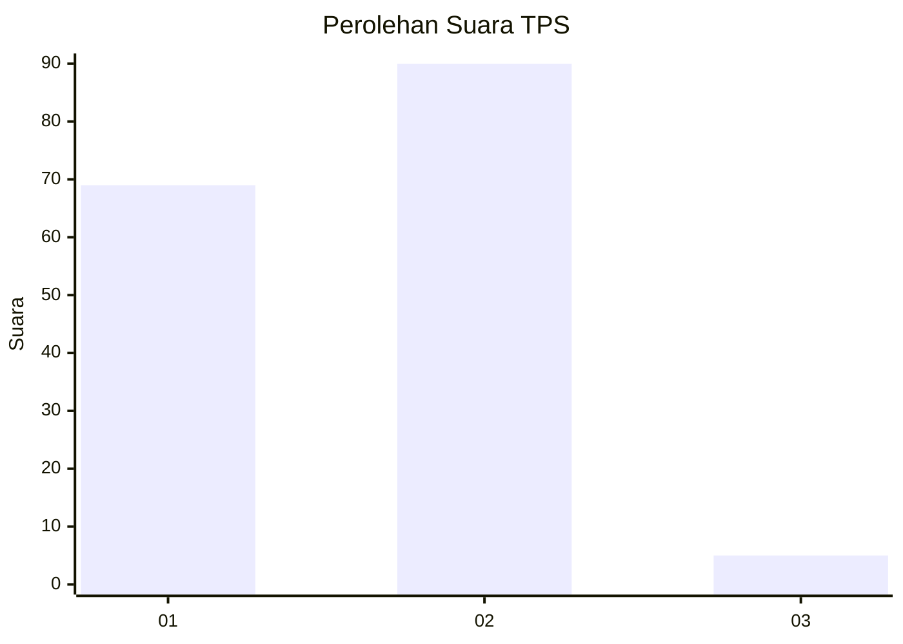
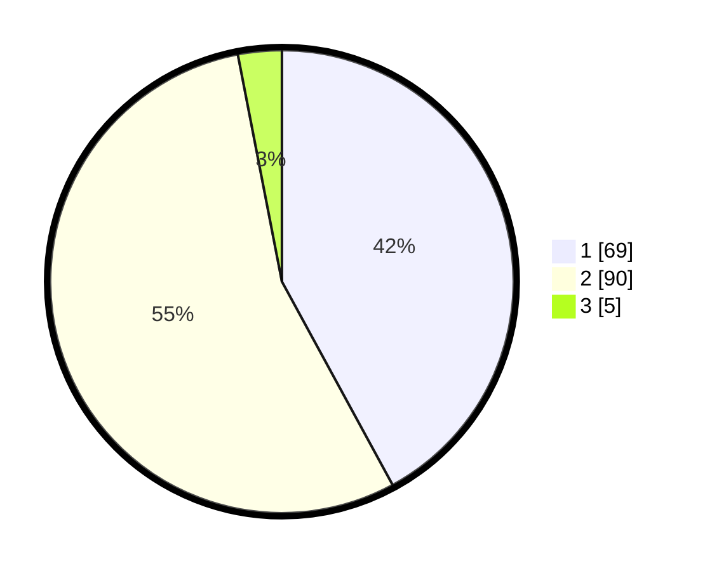

# Hasil

## Grafik

## Tabel

| No. | Nama Paslon    | Suara | Suara (raw) | Persentase |
|:--- |:-------------- | -----:| -----------:| ----------:|
| 1   | ANIES MUHAIMIN | 69    | [69][p-1]   | 42,07      |
| 2   | PRABOWO GIBRAN | 90    | [90][p-2]   | 54,88      |
| 3   | GANJAR MAHFUD  | 5     | [5][p-3]    | 3,05       |

[p-1]: https://github.com/gigit-pemilu/pemilu-2024-12-sumatera-utara/blob/main/pilpres/hitung-suara/sub/12-sumatera-utara/sub/77-kota-padang-sidempuan/sub/05-padangsidimpuan-tenggara/sub/1001-sihitang/sub/006-tps/sub/paslon-1.txt
[p-2]: https://github.com/gigit-pemilu/pemilu-2024-12-sumatera-utara/blob/main/pilpres/hitung-suara/sub/12-sumatera-utara/sub/77-kota-padang-sidempuan/sub/05-padangsidimpuan-tenggara/sub/1001-sihitang/sub/006-tps/sub/paslon-2.txt
[p-3]: https://github.com/gigit-pemilu/pemilu-2024-12-sumatera-utara/blob/main/pilpres/hitung-suara/sub/12-sumatera-utara/sub/77-kota-padang-sidempuan/sub/05-padangsidimpuan-tenggara/sub/1001-sihitang/sub/006-tps/sub/paslon-3.txt

## Foto C Plano

https://sirekap-obj-formc.kpu.go.id/50a5/pemilu/ppwp/12/77/05/10/01/1277051001006-20240214-225755--54322c75-33dd-47e1-96c9-6219db78bfd0.jpg

https://sirekap-obj-formc.kpu.go.id/50a5/pemilu/ppwp/12/77/05/10/01/1277051001006-20240214-220651--9bc9e45d-7f60-4482-8fca-ea66057652da.jpg

https://sirekap-obj-formc.kpu.go.id/50a5/pemilu/ppwp/12/77/05/10/01/1277051001006-20240214-220705--f2e20661-c227-4ff3-87ab-d5b2825cb484.jpg

## Metadata

| Key        | Value               |
| ---------- | ------------------- |
| Time Stamp | 2024-02-15 22:00:27 |

