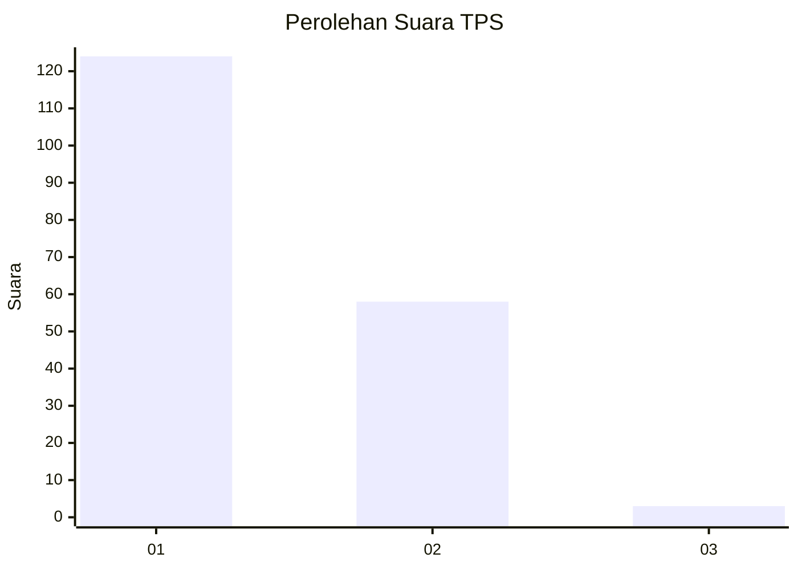
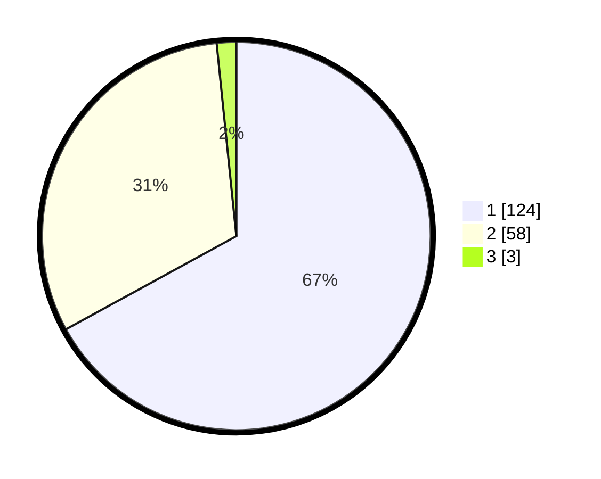

# Hasil

## Grafik

## Tabel

| No. | Nama Paslon    | Suara | Suara (raw) | Persentase |
|:--- |:-------------- | -----:| -----------:| ----------:|
| 1   | ANIES MUHAIMIN | 124   | [124][p-1]  | 67,03      |
| 2   | PRABOWO GIBRAN | 58    | [58][p-2]   | 31,35      |
| 3   | GANJAR MAHFUD  | 3     | [3][p-3]    | 1,62       |

[p-1]: https://github.com/gigit-pemilu/pemilu-2024-12-sumatera-utara/blob/main/pilpres/hitung-suara/sub/12-sumatera-utara/sub/77-kota-padang-sidempuan/sub/05-padangsidimpuan-tenggara/sub/1002-pijor-koling/sub/001-tps/sub/paslon-1.txt
[p-2]: https://github.com/gigit-pemilu/pemilu-2024-12-sumatera-utara/blob/main/pilpres/hitung-suara/sub/12-sumatera-utara/sub/77-kota-padang-sidempuan/sub/05-padangsidimpuan-tenggara/sub/1002-pijor-koling/sub/001-tps/sub/paslon-2.txt
[p-3]: https://github.com/gigit-pemilu/pemilu-2024-12-sumatera-utara/blob/main/pilpres/hitung-suara/sub/12-sumatera-utara/sub/77-kota-padang-sidempuan/sub/05-padangsidimpuan-tenggara/sub/1002-pijor-koling/sub/001-tps/sub/paslon-3.txt

## Foto C Plano

https://sirekap-obj-formc.kpu.go.id/67c2/pemilu/ppwp/12/77/05/10/02/1277051002001-20240215-012615--4b257ce2-f51b-485a-8047-36af22d830d3.jpg

https://sirekap-obj-formc.kpu.go.id/67c2/pemilu/ppwp/12/77/05/10/02/1277051002001-20240215-012716--3bacd9c3-b319-4c01-b19d-84d7f7b38037.jpg

https://sirekap-obj-formc.kpu.go.id/67c2/pemilu/ppwp/12/77/05/10/02/1277051002001-20240215-013459--52a36522-94e8-4326-bc24-70869d6364e2.jpg

## Metadata

| Key        | Value               |
| ---------- | ------------------- |
| Time Stamp | 2024-02-15 22:30:27 |

