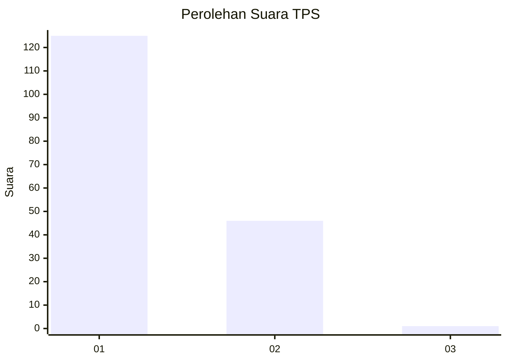
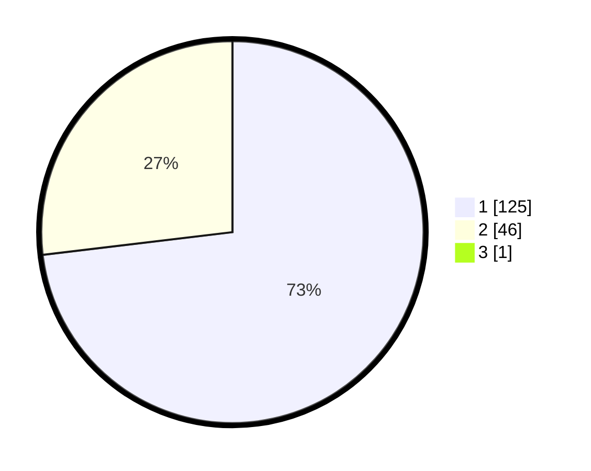

# Hasil

## Grafik

## Tabel

| No. | Nama Paslon    | Suara | Suara (raw) | Persentase |
|:--- |:-------------- | -----:| -----------:| ----------:|
| 1   | ANIES MUHAIMIN | 125   | [125][p-1]  | 72,67      |
| 2   | PRABOWO GIBRAN | 46    | [46][p-2]   | 26,74      |
| 3   | GANJAR MAHFUD  | 1     | [1][p-3]    | 0,58       |

[p-1]: https://github.com/gigit-pemilu/pemilu-2024/blob/main/pilpres/hitung-suara/sub/12-sumatera-utara/sub/77-kota-padang-sidempuan/sub/05-padangsidimpuan-tenggara/sub/1002-pijor-koling/sub/003-tps/sub/paslon-1.txt
[p-2]: https://github.com/gigit-pemilu/pemilu-2024/blob/main/pilpres/hitung-suara/sub/12-sumatera-utara/sub/77-kota-padang-sidempuan/sub/05-padangsidimpuan-tenggara/sub/1002-pijor-koling/sub/003-tps/sub/paslon-2.txt
[p-3]: https://github.com/gigit-pemilu/pemilu-2024/blob/main/pilpres/hitung-suara/sub/12-sumatera-utara/sub/77-kota-padang-sidempuan/sub/05-padangsidimpuan-tenggara/sub/1002-pijor-koling/sub/003-tps/sub/paslon-3.txt

## Foto C Plano

https://sirekap-obj-formc.kpu.go.id/3d98/pemilu/ppwp/12/77/05/10/02/1277051002003-20240214-231228--ed6ebe83-25b6-484e-aff1-2235e5998df0.jpg

https://sirekap-obj-formc.kpu.go.id/3d98/pemilu/ppwp/12/77/05/10/02/1277051002003-20240214-231340--279a3418-5fbe-408d-9a2c-cef9e7239cf8.jpg

https://sirekap-obj-formc.kpu.go.id/3d98/pemilu/ppwp/12/77/05/10/02/1277051002003-20240214-231456--b4b0ba8a-470a-40e2-a32e-8c969ea1ff95.jpg

## Metadata

| Key        | Value               |
| ---------- | ------------------- |
| Time Stamp | 2024-02-24 22:31:28 |

