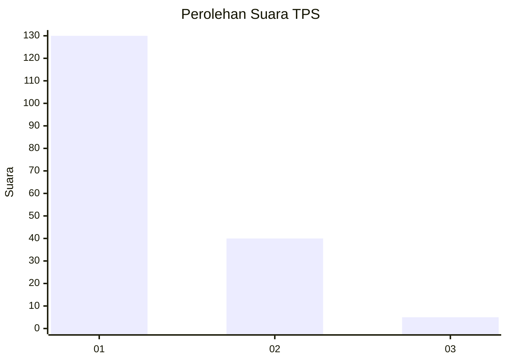
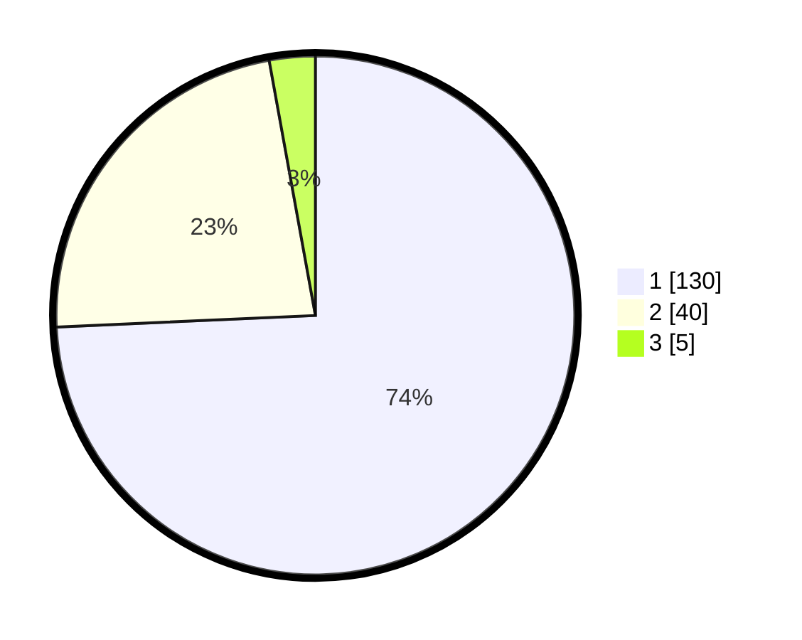

# Hasil

## Grafik

## Tabel

| No. | Nama Paslon    | Suara | Suara (raw) | Persentase |
|:--- |:-------------- | -----:| -----------:| ----------:|
| 1   | ANIES MUHAIMIN | 130   | [130][p-1]  | 74,29      |
| 2   | PRABOWO GIBRAN | 40    | [40][p-2]   | 22,86      |
| 3   | GANJAR MAHFUD  | 5     | [5][p-3]    | 2,86       |

[p-1]: https://github.com/gigit-pemilu/pemilu-2024-12-sumatera-utara/blob/main/pilpres/hitung-suara/sub/12-sumatera-utara/sub/77-kota-padang-sidempuan/sub/05-padangsidimpuan-tenggara/sub/1002-pijor-koling/sub/004-tps/sub/paslon-1.txt
[p-2]: https://github.com/gigit-pemilu/pemilu-2024-12-sumatera-utara/blob/main/pilpres/hitung-suara/sub/12-sumatera-utara/sub/77-kota-padang-sidempuan/sub/05-padangsidimpuan-tenggara/sub/1002-pijor-koling/sub/004-tps/sub/paslon-2.txt
[p-3]: https://github.com/gigit-pemilu/pemilu-2024-12-sumatera-utara/blob/main/pilpres/hitung-suara/sub/12-sumatera-utara/sub/77-kota-padang-sidempuan/sub/05-padangsidimpuan-tenggara/sub/1002-pijor-koling/sub/004-tps/sub/paslon-3.txt

## Foto C Plano

https://sirekap-obj-formc.kpu.go.id/794e/pemilu/ppwp/12/77/05/10/02/1277051002004-20240214-230913--73da8900-97d3-4578-9273-9cef9884b192.jpg

https://sirekap-obj-formc.kpu.go.id/794e/pemilu/ppwp/12/77/05/10/02/1277051002004-20240214-231144--60452c4f-9159-4105-9d20-b716efcaca9f.jpg

https://sirekap-obj-formc.kpu.go.id/794e/pemilu/ppwp/12/77/05/10/02/1277051002004-20240214-231329--39d9914c-3074-4c35-9676-5ebc14cd844b.jpg

## Metadata

| Key        | Value               |
| ---------- | ------------------- |
| Time Stamp | 2024-02-19 12:00:00 |

