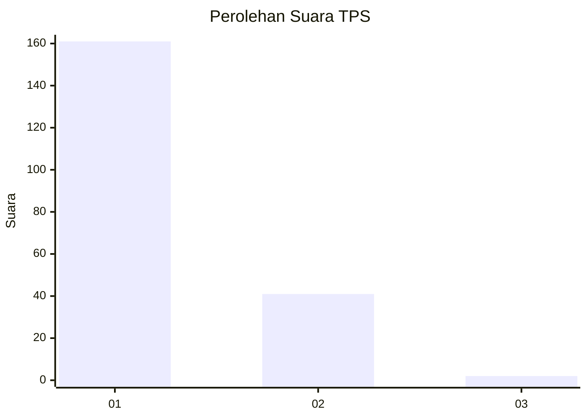
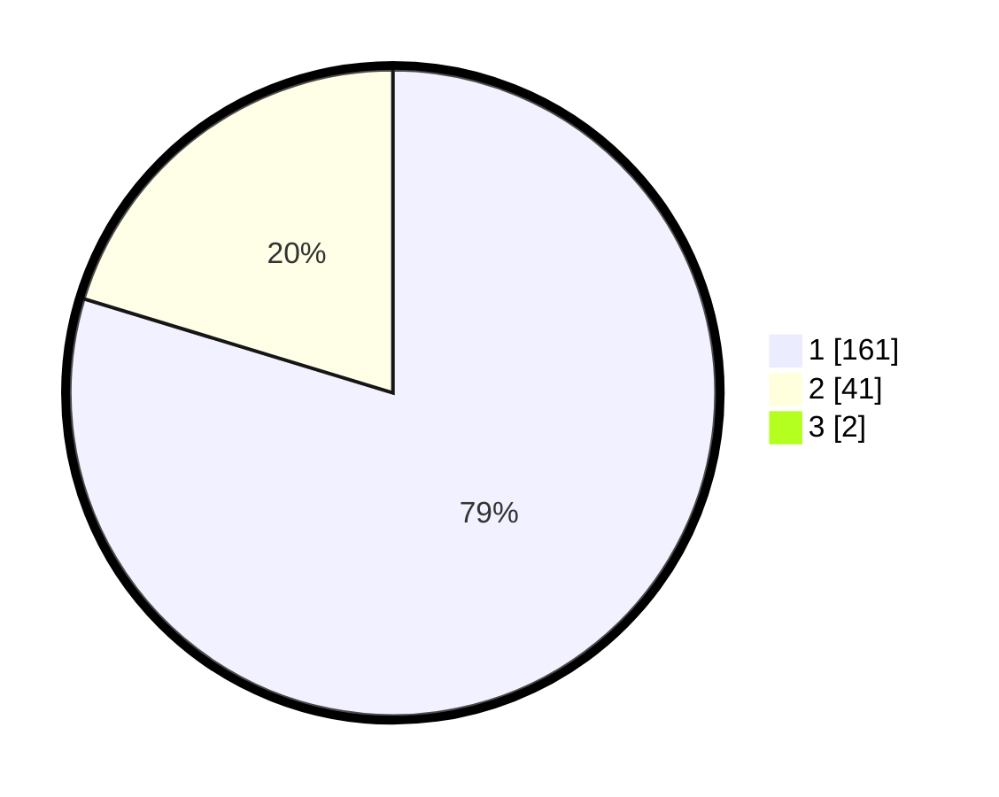

# Hasil

## Grafik

## Tabel

| No. | Nama Paslon    | Suara | Suara (raw) | Persentase |
|:--- |:-------------- | -----:| -----------:| ----------:|
| 1   | ANIES MUHAIMIN | 161   | [161][p-1]  | 78,92      |
| 2   | PRABOWO GIBRAN | 41    | [41][p-2]   | 20,10      |
| 3   | GANJAR MAHFUD  | 2     | [2][p-3]    | 0,98       |

[p-1]: https://github.com/gigit-pemilu/pemilu-2024-12-sumatera-utara/blob/main/pilpres/hitung-suara/sub/12-sumatera-utara/sub/77-kota-padang-sidempuan/sub/05-padangsidimpuan-tenggara/sub/1002-pijor-koling/sub/005-tps/sub/paslon-1.txt
[p-2]: https://github.com/gigit-pemilu/pemilu-2024-12-sumatera-utara/blob/main/pilpres/hitung-suara/sub/12-sumatera-utara/sub/77-kota-padang-sidempuan/sub/05-padangsidimpuan-tenggara/sub/1002-pijor-koling/sub/005-tps/sub/paslon-2.txt
[p-3]: https://github.com/gigit-pemilu/pemilu-2024-12-sumatera-utara/blob/main/pilpres/hitung-suara/sub/12-sumatera-utara/sub/77-kota-padang-sidempuan/sub/05-padangsidimpuan-tenggara/sub/1002-pijor-koling/sub/005-tps/sub/paslon-3.txt

## Foto C Plano

https://sirekap-obj-formc.kpu.go.id/3b8a/pemilu/ppwp/12/77/05/10/02/1277051002005-20240214-235122--da347274-0f46-44a8-b465-e919e3b49928.jpg

https://sirekap-obj-formc.kpu.go.id/3b8a/pemilu/ppwp/12/77/05/10/02/1277051002005-20240214-235251--ad1f54a6-3613-4f01-9108-a9279f9c5141.jpg

https://sirekap-obj-formc.kpu.go.id/3b8a/pemilu/ppwp/12/77/05/10/02/1277051002005-20240214-225217--b1716737-dc95-449c-931a-511bfe109004.jpg

## Metadata

| Key        | Value               |
| ---------- | ------------------- |
| Time Stamp | 2024-02-19 12:00:00 |

