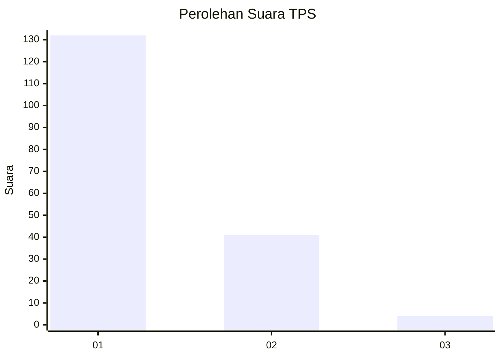
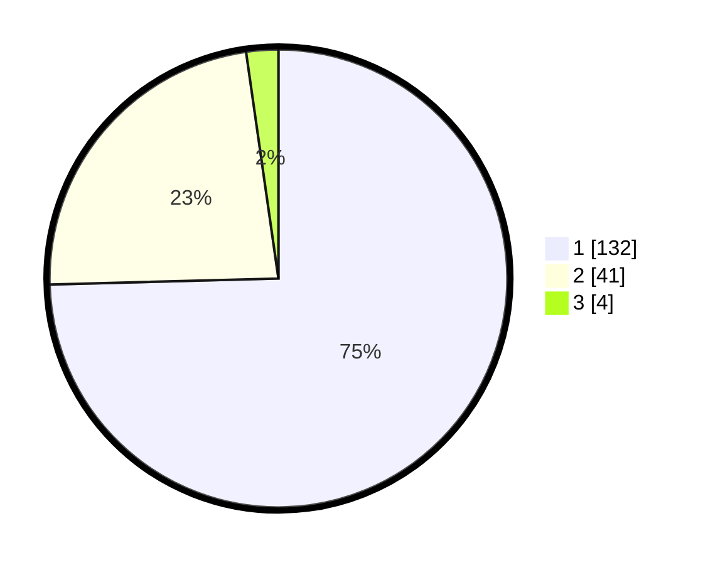

# Hasil

## Grafik

## Tabel

| No. | Nama Paslon    | Suara | Suara (raw) | Persentase |
|:--- |:-------------- | -----:| -----------:| ----------:|
| 1   | ANIES MUHAIMIN | 132   | [132][p-1]  | 74,58      |
| 2   | PRABOWO GIBRAN | 41    | [41][p-2]   | 23,16      |
| 3   | GANJAR MAHFUD  | 4     | [4][p-3]    | 2,26       |

[p-1]: https://github.com/gigit-pemilu/pemilu-2024-12-sumatera-utara/blob/main/pilpres/hitung-suara/sub/12-sumatera-utara/sub/77-kota-padang-sidempuan/sub/05-padangsidimpuan-tenggara/sub/1002-pijor-koling/sub/006-tps/sub/paslon-1.txt
[p-2]: https://github.com/gigit-pemilu/pemilu-2024-12-sumatera-utara/blob/main/pilpres/hitung-suara/sub/12-sumatera-utara/sub/77-kota-padang-sidempuan/sub/05-padangsidimpuan-tenggara/sub/1002-pijor-koling/sub/006-tps/sub/paslon-2.txt
[p-3]: https://github.com/gigit-pemilu/pemilu-2024-12-sumatera-utara/blob/main/pilpres/hitung-suara/sub/12-sumatera-utara/sub/77-kota-padang-sidempuan/sub/05-padangsidimpuan-tenggara/sub/1002-pijor-koling/sub/006-tps/sub/paslon-3.txt

## Foto C Plano

https://sirekap-obj-formc.kpu.go.id/a364/pemilu/ppwp/12/77/05/10/02/1277051002006-20240215-061425--99a6f043-f4f9-4072-b3af-96c758d7b024.jpg

https://sirekap-obj-formc.kpu.go.id/a364/pemilu/ppwp/12/77/05/10/02/1277051002006-20240215-061516--6db7d9aa-4de4-416d-b82f-f01730a875d3.jpg

https://sirekap-obj-formc.kpu.go.id/a364/pemilu/ppwp/12/77/05/10/02/1277051002006-20240215-061559--7da3e747-e5fb-42e8-9b33-c05de3f1fc68.jpg

## Metadata

| Key        | Value               |
| ---------- | ------------------- |
| Time Stamp | 2024-02-25 13:00:00 |

