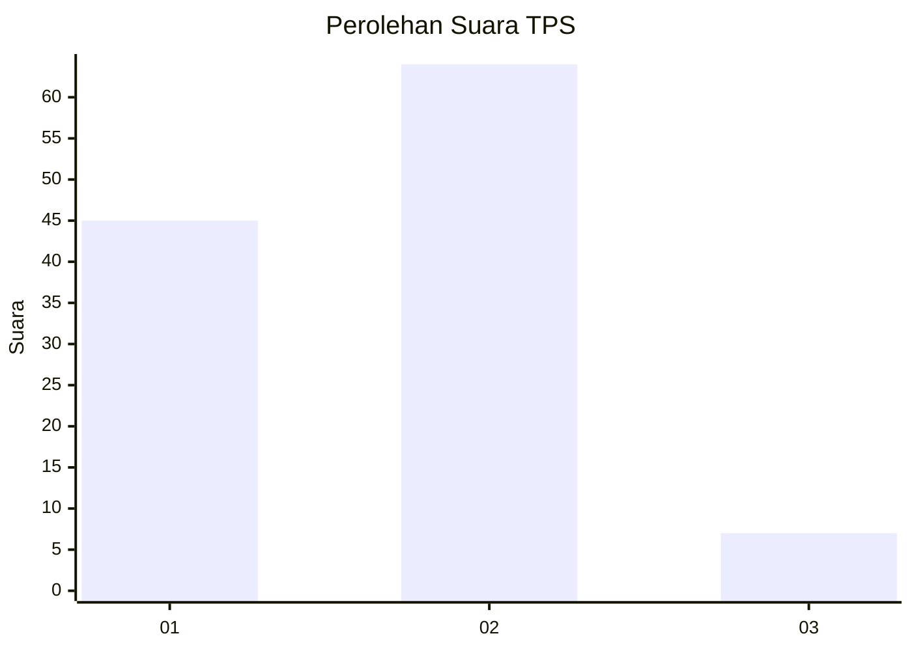
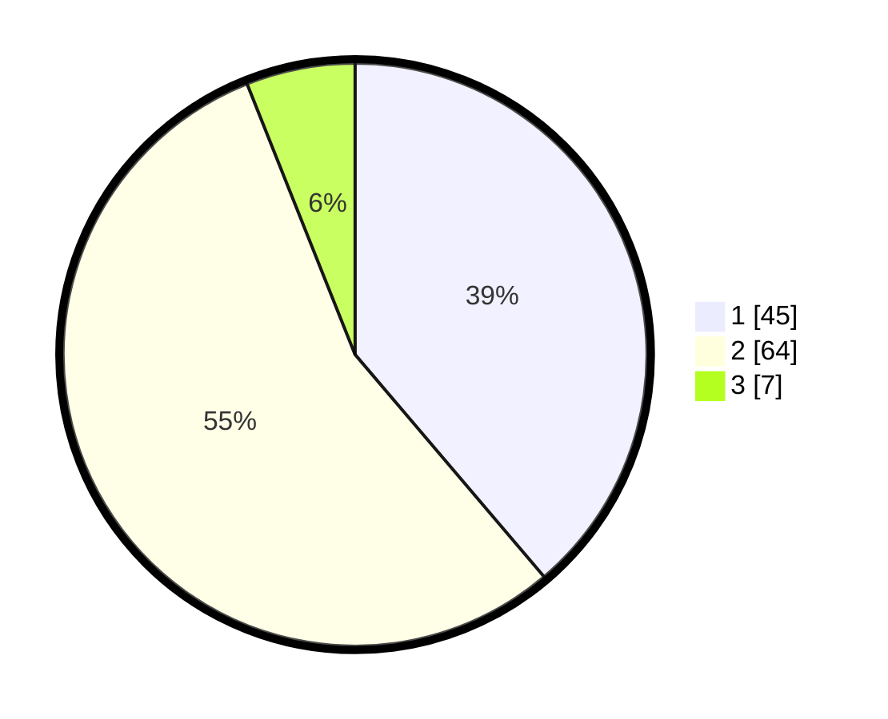

# Hasil

## Grafik

## Tabel

| No. | Nama Paslon    | Suara | Suara (raw) | Persentase |
|:--- |:-------------- | -----:| -----------:| ----------:|
| 1   | ANIES MUHAIMIN | 45    | [45][p-1]   | 38,79      |
| 2   | PRABOWO GIBRAN | 64    | [64][p-2]   | 55,17      |
| 3   | GANJAR MAHFUD  | 7     | [7][p-3]    | 6,03       |

[p-1]: https://github.com/gigit-pemilu/pemilu-2024/blob/main/pilpres/hitung-suara/sub/12-sumatera-utara/sub/77-kota-padang-sidempuan/sub/05-padangsidimpuan-tenggara/sub/2003-palopat-pijor-koling/sub/003-tps/sub/paslon-1.txt
[p-2]: https://github.com/gigit-pemilu/pemilu-2024/blob/main/pilpres/hitung-suara/sub/12-sumatera-utara/sub/77-kota-padang-sidempuan/sub/05-padangsidimpuan-tenggara/sub/2003-palopat-pijor-koling/sub/003-tps/sub/paslon-2.txt
[p-3]: https://github.com/gigit-pemilu/pemilu-2024/blob/main/pilpres/hitung-suara/sub/12-sumatera-utara/sub/77-kota-padang-sidempuan/sub/05-padangsidimpuan-tenggara/sub/2003-palopat-pijor-koling/sub/003-tps/sub/paslon-3.txt

## Foto C Plano

https://sirekap-obj-formc.kpu.go.id/6489/pemilu/ppwp/12/77/05/20/03/1277052003003-20240215-025840--e59bda7a-2116-425a-854a-f9d66843bd5d.jpg

https://sirekap-obj-formc.kpu.go.id/6489/pemilu/ppwp/12/77/05/20/03/1277052003003-20240215-025857--4e36f893-5bac-4862-82b5-0c915f8ab6f6.jpg

https://sirekap-obj-formc.kpu.go.id/6489/pemilu/ppwp/12/77/05/20/03/1277052003003-20240215-025911--7fe8fa49-b07d-4756-b34e-263da8a92e13.jpg

## Metadata

| Key        | Value               |
| ---------- | ------------------- |
| Time Stamp | 2024-02-25 13:00:00 |

