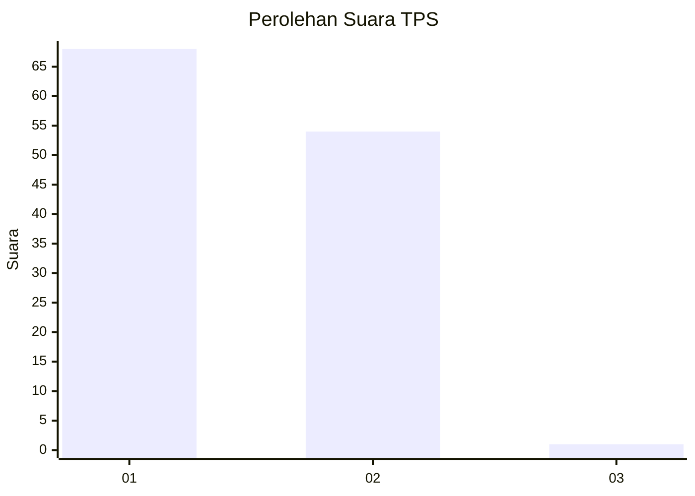
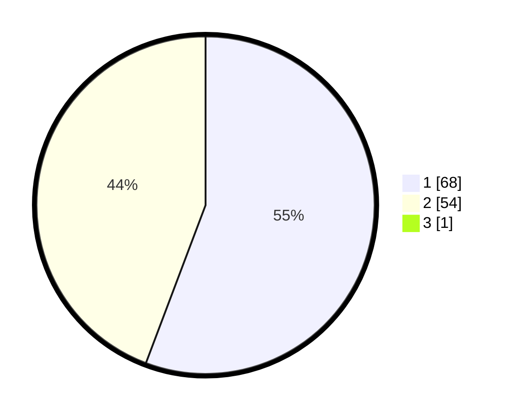

# Hasil

## Grafik

## Tabel

| No. | Nama Paslon    | Suara | Suara (raw) | Persentase |
|:--- |:-------------- | -----:| -----------:| ----------:|
| 1   | ANIES MUHAIMIN | 68    | [68][p-1]   | 55,28      |
| 2   | PRABOWO GIBRAN | 54    | [54][p-2]   | 43,90      |
| 3   | GANJAR MAHFUD  | 1     | [1][p-3]    | 0,81       |

[p-1]: https://github.com/gigit-pemilu/pemilu-2024-12-sumatera-utara/blob/main/pilpres/hitung-suara/sub/12-sumatera-utara/sub/77-kota-padang-sidempuan/sub/05-padangsidimpuan-tenggara/sub/2008-goti/sub/001-tps/sub/paslon-1.txt
[p-2]: https://github.com/gigit-pemilu/pemilu-2024-12-sumatera-utara/blob/main/pilpres/hitung-suara/sub/12-sumatera-utara/sub/77-kota-padang-sidempuan/sub/05-padangsidimpuan-tenggara/sub/2008-goti/sub/001-tps/sub/paslon-2.txt
[p-3]: https://github.com/gigit-pemilu/pemilu-2024-12-sumatera-utara/blob/main/pilpres/hitung-suara/sub/12-sumatera-utara/sub/77-kota-padang-sidempuan/sub/05-padangsidimpuan-tenggara/sub/2008-goti/sub/001-tps/sub/paslon-3.txt

## Foto C Plano

https://sirekap-obj-formc.kpu.go.id/f677/pemilu/ppwp/12/77/05/20/08/1277052008001-20240215-010548--0ada926f-6ce9-4298-8b3a-e0a401f4a40b.jpg

https://sirekap-obj-formc.kpu.go.id/f677/pemilu/ppwp/12/77/05/20/08/1277052008001-20240215-010756--2c64f0ae-59bd-4ba7-84e3-2061271c0cd5.jpg

https://sirekap-obj-formc.kpu.go.id/f677/pemilu/ppwp/12/77/05/20/08/1277052008001-20240215-014646--f1d53816-e630-4a49-89ab-23cd67003d2a.jpg

## Metadata

| Key        | Value               |
| ---------- | ------------------- |
| Time Stamp | 2024-02-19 12:00:00 |

