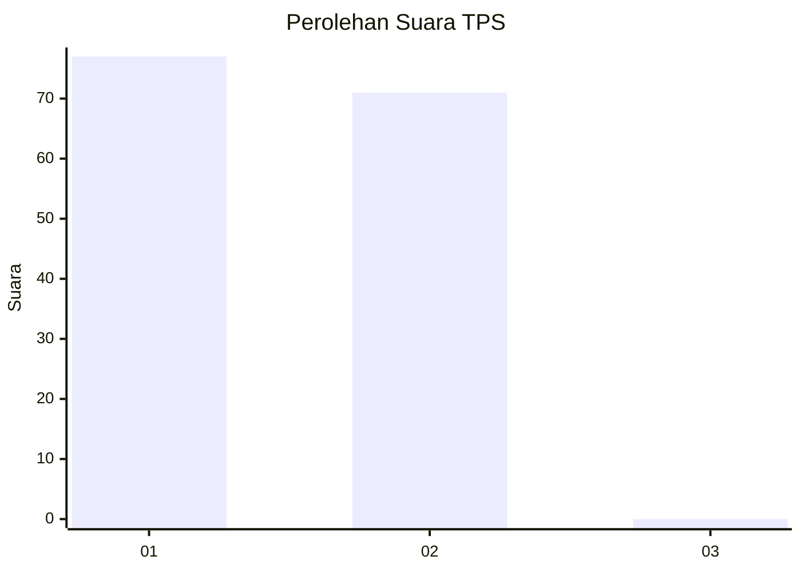
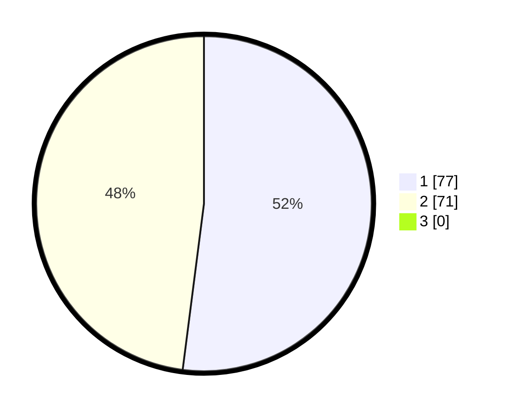

# Hasil

## Grafik

## Tabel

| No. | Nama Paslon    | Suara | Suara (raw) | Persentase |
|:--- |:-------------- | -----:| -----------:| ----------:|
| 1   | ANIES MUHAIMIN | 77    | [77][p-1]   | 52,03      |
| 2   | PRABOWO GIBRAN | 71    | [71][p-2]   | 47,97      |
| 3   | GANJAR MAHFUD  | 0     | [0][p-3]    | 0,00       |

[p-1]: https://github.com/gigit-pemilu/pemilu-2024/blob/main/pilpres/hitung-suara/sub/12-sumatera-utara/sub/77-kota-padang-sidempuan/sub/06-padangsidimpuan-angkola-julu/sub/2001-joring-lombang/sub/001-tps/sub/paslon-1.txt
[p-2]: https://github.com/gigit-pemilu/pemilu-2024/blob/main/pilpres/hitung-suara/sub/12-sumatera-utara/sub/77-kota-padang-sidempuan/sub/06-padangsidimpuan-angkola-julu/sub/2001-joring-lombang/sub/001-tps/sub/paslon-2.txt
[p-3]: https://github.com/gigit-pemilu/pemilu-2024/blob/main/pilpres/hitung-suara/sub/12-sumatera-utara/sub/77-kota-padang-sidempuan/sub/06-padangsidimpuan-angkola-julu/sub/2001-joring-lombang/sub/001-tps/sub/paslon-3.txt

## Foto C Plano

https://sirekap-obj-formc.kpu.go.id/8aaf/pemilu/ppwp/12/77/06/20/01/1277062001001-20240214-223307--a54c003b-cf01-4e1d-90db-0f9b16288f9c.jpg

https://sirekap-obj-formc.kpu.go.id/8aaf/pemilu/ppwp/12/77/06/20/01/1277062001001-20240214-223340--f904f727-34b6-43e5-abba-741f85196906.jpg

https://sirekap-obj-formc.kpu.go.id/8aaf/pemilu/ppwp/12/77/06/20/01/1277062001001-20240214-223403--02362190-e173-42bf-a01c-4ff6e1af7a48.jpg

## Metadata

| Key        | Value               |
| ---------- | ------------------- |
| Time Stamp | 2024-02-15 23:29:50 |

