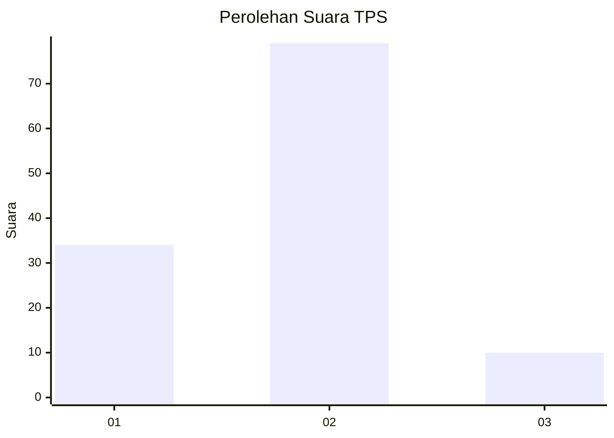
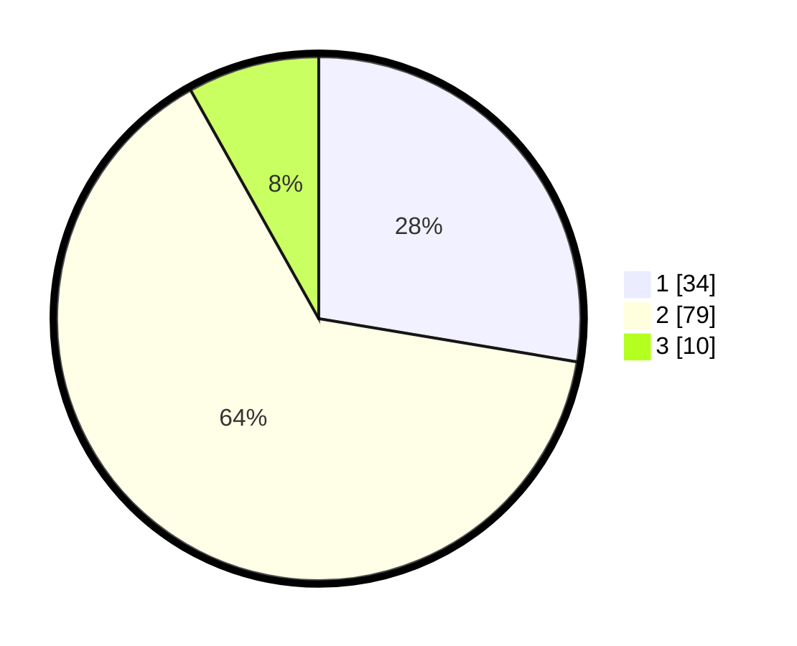

# Hasil

## Grafik

## Tabel

| No. | Nama Paslon    | Suara | Suara (raw) | Persentase |
|:--- |:-------------- | -----:| -----------:| ----------:|
| 1   | ANIES MUHAIMIN | 34    | [34][p-1]   | 27,64      |
| 2   | PRABOWO GIBRAN | 79    | [79][p-2]   | 64,23      |
| 3   | GANJAR MAHFUD  | 10    | [10][p-3]   | 8,13       |

[p-1]: https://github.com/gigit-pemilu/pemilu-2024/blob/main/pilpres/hitung-suara/sub/12-sumatera-utara/sub/77-kota-padang-sidempuan/sub/06-padangsidimpuan-angkola-julu/sub/2003-simasom/sub/001-tps/sub/paslon-1.txt
[p-2]: https://github.com/gigit-pemilu/pemilu-2024/blob/main/pilpres/hitung-suara/sub/12-sumatera-utara/sub/77-kota-padang-sidempuan/sub/06-padangsidimpuan-angkola-julu/sub/2003-simasom/sub/001-tps/sub/paslon-2.txt
[p-3]: https://github.com/gigit-pemilu/pemilu-2024/blob/main/pilpres/hitung-suara/sub/12-sumatera-utara/sub/77-kota-padang-sidempuan/sub/06-padangsidimpuan-angkola-julu/sub/2003-simasom/sub/001-tps/sub/paslon-3.txt

## Foto C Plano

https://sirekap-obj-formc.kpu.go.id/8087/pemilu/ppwp/12/77/06/20/03/1277062003001-20240215-091002--331ac58a-6d68-4b38-a1c0-1a8599c4fa5c.jpg

https://sirekap-obj-formc.kpu.go.id/8087/pemilu/ppwp/12/77/06/20/03/1277062003001-20240215-091049--0c15033b-5635-4692-8f0e-441eda9375ab.jpg

https://sirekap-obj-formc.kpu.go.id/8087/pemilu/ppwp/12/77/06/20/03/1277062003001-20240215-091204--6789cd32-428c-45e0-91ee-e88fa5b56d09.jpg

## Metadata

| Key        | Value               |
| ---------- | ------------------- |
| Time Stamp | 2024-02-16 10:30:29 |

